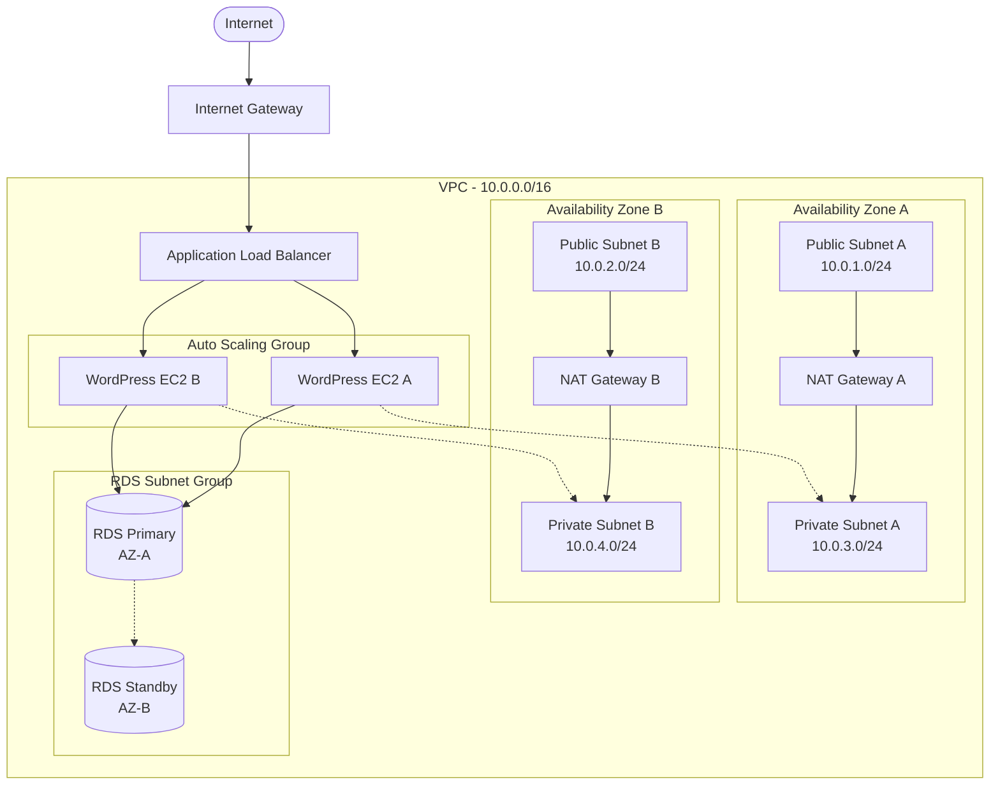

# Project 4: Deploy a fault-tolerant WordPress site using EC2, an Application Load Balancer (ALB), and an RDS Multi-AZ database in a custom VPC

## 1. Objective
In this project, you will build a highly available, fault-tolerant WordPress website using AWS best practices. You'll create a custom VPC with public and private subnets across multiple Availability Zones, deploy WordPress on EC2 instances behind an Application Load Balancer, and use an RDS Multi-AZ MySQL database for data persistence. This project demonstrates enterprise-grade architecture patterns including high availability, fault tolerance, and proper security practices with network isolation.

Key learning outcomes:
- Design and implement a multi-tier architecture in AWS
- Configure VPC networking with public and private subnets
- Set up Application Load Balancer for high availability
- Deploy RDS Multi-AZ for database fault tolerance
- Implement proper security groups and NACLs
- Configure Auto Scaling for dynamic capacity management

## 2. AWS Services Used
- **Amazon VPC** - Custom virtual private cloud with public/private subnets
- **Amazon EC2** - Web servers hosting WordPress application
- **Application Load Balancer (ALB)** - Distributes traffic across multiple EC2 instances
- **Amazon RDS** - Multi-AZ MySQL database for WordPress data
- **Auto Scaling Group** - Automatically scales EC2 instances based on demand
- **Security Groups** - Instance-level firewall rules
- **Internet Gateway** - Provides internet access to public subnets
- **NAT Gateway** - Enables internet access for private subnet resources
- **Route 53** (Optional) - DNS management for custom domain

## 3. Difficulty
Intermediate

## 4. Architecture Diagram



## 5. Prerequisites
- Ensure you have completed the initial setup detailed in the main [PREREQUISITES.md](../PREREQUISITES.md) file in the repository root.
- Basic understanding of networking concepts (subnets, routing, firewalls)
- Familiarity with Linux command line and WordPress basics

## 6. Step-by-Step Guide

### Phase 1: VPC and Networking Setup

#### Step 1: Create Custom VPC
1. Navigate to **VPC Dashboard** in AWS Console
2. Click **Create VPC**
3. Select **VPC and more** (recommended for beginners)
4. Configure:
   - **Name tag auto-generation**: `wordpress-vpc`
   - **IPv4 CIDR block**: `10.0.0.0/16`
   - **Number of Availability Zones**: `2`
   - **Number of public subnets**: `2`
   - **Number of private subnets**: `2`
   - **NAT gateways**: `In 1 AZ` (for cost optimization)
   - **VPC endpoints**: `None`
5. Click **Create VPC**

**Alternative Manual Setup (if you want more control):**
- Create VPC with CIDR `10.0.0.0/16`
- Create 4 subnets:
  - Public Subnet A: `10.0.1.0/24` (us-east-1a)
  - Public Subnet B: `10.0.2.0/24` (us-east-1b)
  - Private Subnet A: `10.0.3.0/24` (us-east-1a)
  - Private Subnet B: `10.0.4.0/24` (us-east-1b)
- Create and attach Internet Gateway
- Create NAT Gateway in Public Subnet A
- Configure route tables appropriately

### Phase 2: Database Setup

#### Step 2: Create RDS Subnet Group
1. Navigate to **RDS Dashboard**
2. Go to **Subnet groups** → **Create DB subnet group**
3. Configure:
   - **Name**: `wordpress-db-subnet-group`
   - **Description**: `Subnet group for WordPress RDS`
   - **VPC**: Select your `wordpress-vpc`
   - **Availability Zones**: Select both AZs (us-east-1a, us-east-1b)
   - **Subnets**: Select both private subnets
4. Click **Create**

#### Step 3: Create RDS Database
1. In RDS Dashboard, click **Create database**
2. Configure:
   - **Database creation method**: `Standard create`
   - **Engine**: `MySQL`
   - **Version**: `8.0.35` (or latest)
   - **Templates**: `Free tier` (if eligible) or `Production`
   - **DB instance identifier**: `wordpress-db`
   - **Master username**: `admin`
   - **Master password**: Use password from `assets/db-config.txt`
   - **DB instance class**: `db.t3.micro` (Free tier) or `db.t3.small`
   - **Storage type**: `General Purpose SSD (gp2)`
   - **Allocated storage**: `20 GB`
   - **Enable storage autoscaling**: ✓
   - **Multi-AZ deployment**: ✓ (Enable for fault tolerance)
   - **VPC**: `wordpress-vpc`
   - **DB Subnet group**: `wordpress-db-subnet-group`
   - **Public access**: `No`
   - **VPC security group**: Create new → `wordpress-db-sg`
   - **Database port**: `3306`
   - **Initial database name**: `wordpress`
3. Click **Create database**

### Phase 3: Security Groups Setup

#### Step 4: Create Security Groups
Create the following security groups in your VPC:

**ALB Security Group (`wordpress-alb-sg`):**
- Inbound: HTTP (80) from 0.0.0.0/0
- Inbound: HTTPS (443) from 0.0.0.0/0
- Outbound: All traffic

**Web Server Security Group (`wordpress-web-sg`):**
- Inbound: HTTP (80) from ALB Security Group
- Inbound: SSH (22) from your IP (for management)
- Outbound: All traffic

**Database Security Group (`wordpress-db-sg`):**
- Inbound: MySQL/Aurora (3306) from Web Server Security Group
- Outbound: All traffic

### Phase 4: Launch Template and Auto Scaling

#### Step 5: Create Launch Template
1. Navigate to **EC2 Dashboard** → **Launch Templates**
2. Click **Create launch template**
3. Configure:
   - **Template name**: `wordpress-launch-template`
   - **Template version description**: `WordPress server template v1`
   - **AMI**: `Amazon Linux 2023 AMI`
   - **Instance type**: `t3.micro` (Free tier eligible)
   - **Key pair**: Select your existing key pair
   - **Security groups**: `wordpress-web-sg`
   - **Advanced details** → **User data**: Paste content from `assets/wordpress-userdata.sh`
4. Click **Create launch template**

#### Step 6: Create Auto Scaling Group
1. Navigate to **Auto Scaling** → **Auto Scaling Groups**
2. Click **Create Auto Scaling group**
3. Configure:
   - **Name**: `wordpress-asg`
   - **Launch template**: `wordpress-launch-template`
   - **VPC**: `wordpress-vpc`
   - **Subnets**: Select both private subnets
   - **Load balancing**: `Attach to a new load balancer`
   - **Load balancer type**: `Application Load Balancer`
   - **Load balancer name**: `wordpress-alb`
   - **Load balancer scheme**: `Internet-facing`
   - **Target group name**: `wordpress-targets`
   - **Health check type**: `ELB`
   - **Health check grace period**: `300 seconds`
   - **Group size**:
     - Desired: `2`
     - Minimum: `1`
     - Maximum: `4`
   - **Scaling policies**: `Target tracking scaling policy`
     - Metric: `Average CPU utilization`
     - Target value: `70`
4. Click **Create Auto Scaling group**

### Phase 7: Application Load Balancer Configuration

#### Step 7: Configure ALB (if not done via Auto Scaling)
If you need to manually configure the ALB:
1. Navigate to **EC2** → **Load Balancers**
2. Find your `wordpress-alb` and click on it
3. Update security group to `wordpress-alb-sg`
4. Configure health check:
   - **Health check path**: `/wp-admin/install.php`
   - **Healthy threshold**: `2`
   - **Interval**: `30 seconds`

### Phase 8: WordPress Configuration

#### Step 8: Access WordPress Setup
1. Wait for Auto Scaling Group to launch instances (5-10 minutes)
2. Check ALB target group health in EC2 console
3. Once targets are healthy, copy ALB DNS name
4. Open browser and navigate to ALB DNS name
5. Complete WordPress installation:
   - **Database Name**: `wordpress`
   - **Username**: `admin`
   - **Password**: From `assets/db-config.txt`
   - **Database Host**: RDS endpoint from RDS console
   - **Table Prefix**: `wp_`

#### Step 9: Test Fault Tolerance
1. **Test Auto Scaling**: Create CPU load on one instance
2. **Test Multi-AZ**: Simulate database failover in RDS console
3. **Test Load Balancing**: Stop one EC2 instance and verify traffic routes to healthy instance

### Phase 9: Optional Enhancements

#### Step 10: Configure CloudWatch Monitoring
1. Set up CloudWatch alarms for:
   - EC2 CPU utilization
   - ALB target health
   - RDS connections
   - RDS CPU utilization

#### Step 11: Enable HTTPS (Optional)
1. Request SSL certificate via AWS Certificate Manager
2. Add HTTPS listener to ALB
3. Configure redirect from HTTP to HTTPS

## 7. Learning Materials & Key Concepts

### High Availability Architecture
This project implements several AWS Well-Architected Framework principles:

**Multi-AZ Deployment:**
- RDS Multi-AZ provides automatic failover in case of database instance failure
- Application Load Balancer distributes traffic across multiple Availability Zones
- Auto Scaling Group ensures instances are distributed across AZs

**Fault Tolerance:**
- RDS Multi-AZ maintains a standby replica for automatic failover
- ALB performs health checks and routes traffic only to healthy instances
- Auto Scaling replaces failed instances automatically

**Scalability:**
- Auto Scaling Group adjusts capacity based on CPU utilization
- ALB can handle varying loads without manual intervention
- RDS can scale storage automatically when needed

**Security Best Practices:**
- Private subnets isolate database and application tiers
- Security groups implement principle of least privilege
- NAT Gateway provides controlled internet access for private resources

### Key SAA-C03 Exam Topics Covered:
- **VPC Design**: Multi-tier architecture with public/private subnets
- **Load Balancing**: Application Load Balancer vs Network Load Balancer
- **Auto Scaling**: Scaling policies and health checks
- **RDS Multi-AZ**: Database high availability and failover
- **Security Groups vs NACLs**: Layer 4 vs Layer 3 security
- **NAT Gateway vs NAT Instance**: Managed vs self-managed solutions

### Cost Optimization Considerations:
- Single NAT Gateway instead of per-AZ (trade-off: reduced availability)
- t3.micro instances for cost efficiency
- GP2 storage for RDS (vs more expensive io1/io2)
- Auto Scaling helps avoid over-provisioning

## 8. Cost & Free Tier Eligibility

### Free Tier Eligible Services:
- **EC2**: 750 hours of t2.micro or t3.micro instances per month
- **RDS**: 750 hours of db.t2.micro or db.t3.micro instances per month
- **Application Load Balancer**: 750 hours per month
- **Data Transfer**: 1 GB per month

### **⚠️ Charges Will Apply For:**
- **RDS Multi-AZ**: Doubles the cost as you pay for both primary and standby instances
- **NAT Gateway**: $0.045/hour + data processing charges (~$32/month if left running)
- **Elastic IP**: If you allocate but don't use it ($0.005/hour)
- **Data Transfer**: Beyond free tier limits

### Estimated Monthly Costs (US East 1):
- **EC2 instances (2 x t3.micro)**: Free tier or ~$16/month
- **RDS Multi-AZ (db.t3.micro)**: ~$25/month (no free tier for Multi-AZ)
- **ALB**: Free tier or ~$20/month
- **NAT Gateway**: ~$32/month + data processing
- **EBS Storage**: ~$2/month for 20GB
- **Total**: ~$60-80/month if running continuously

**💡 Cost Savings Tips:**
- Stop/start resources when not in use
- Use db.t3.micro for development (can upgrade for production)
- Consider single-AZ RDS for development environments
- Delete NAT Gateway when not needed (impacts private subnet internet access)

## 9. Cleanup Instructions

⚠️ **Important**: Follow this order to avoid dependency issues and ensure complete resource deletion.

### Step 1: Auto Scaling and Load Balancer Cleanup
```bash
# Scale down Auto Scaling Group first
1. Navigate to Auto Scaling Groups
2. Select wordpress-asg
3. Edit → Set Desired, Min, Max to 0
4. Wait for instances to terminate
5. Delete Auto Scaling Group
6. Delete Launch Template
```

### Step 2: Load Balancer Cleanup
```bash
1. Navigate to EC2 → Load Balancers
2. Select wordpress-alb
3. Actions → Delete
4. Navigate to Target Groups
5. Select wordpress-targets
6. Actions → Delete
```

### Step 3: RDS Cleanup
```bash
1. Navigate to RDS → Databases
2. Select wordpress-db
3. Actions → Delete
4. Uncheck "Create final snapshot" (for lab purposes)
5. Type "delete me" to confirm
6. Delete DB Subnet Group: wordpress-db-subnet-group
```

### Step 4: VPC and Networking Cleanup
```bash
1. Navigate to VPC Dashboard
2. Delete in this order:
   a. NAT Gateways (Release Elastic IPs when prompted)
   b. Internet Gateway (Detach first, then delete)
   c. Route Tables (except main route table)
   d. Security Groups (except default)
   e. Subnets
   f. VPC
```

### Step 5: Verify Cleanup
```bash
1. Check EC2 → Instances (should show "terminated")
2. Check RDS → Databases (should be empty)
3. Check VPC → Your VPCs (should only show default VPC)
4. Check Billing → Cost Explorer for any ongoing charges
```

### Emergency Cleanup Script
If you encounter dependency issues, use the AWS CLI cleanup script in `assets/cleanup.sh`.

## 10. Associated Project Files

The `assets` folder contains the following helper files:

### Configuration Files:
- **`db-config.txt`** - Database connection details and secure password
- **`wordpress-userdata.sh`** - EC2 user data script for WordPress installation
- **`security-groups.json`** - Security group rules in JSON format

### Helper Scripts:
- **`setup-vpc.sh`** - Automated VPC creation script (alternative to console)
- **`cleanup.sh`** - Emergency cleanup script for all resources
- **`test-connectivity.sh`** - Script to test database connectivity from EC2

### IAM Policies:
- **`ec2-role-policy.json`** - IAM policy for EC2 instances (if using IAM roles)
- **`cloudwatch-policy.json`** - CloudWatch monitoring permissions

### Monitoring:
- **`cloudwatch-alarms.json`** - CloudWatch alarm configurations
- **`health-check.sh`** - Custom health check script for instances

These files simplify the deployment process and provide automation options for advanced users while maintaining the hands-on learning experience through the AWS Console.

---

## Troubleshooting Tips

### Common Issues:
1. **WordPress can't connect to database**: Check security group rules and RDS endpoint
2. **ALB returns 502 errors**: Verify target group health and security groups
3. **Instances not joining target group**: Check user data script execution in EC2 logs
4. **High costs**: Ensure you're using free tier eligible instance types

### Useful Commands:
```bash
# Check WordPress installation logs
sudo tail -f /var/log/cloud-init-output.log

# Test database connectivity
mysql -h [RDS_ENDPOINT] -u admin -p wordpress

# Check Apache status
sudo systemctl status httpd
```

**Remember**: This project demonstrates production-ready architecture patterns, so some components (like RDS Multi-AZ) incur costs beyond the free tier. Always clean up resources promptly to minimize charges!
