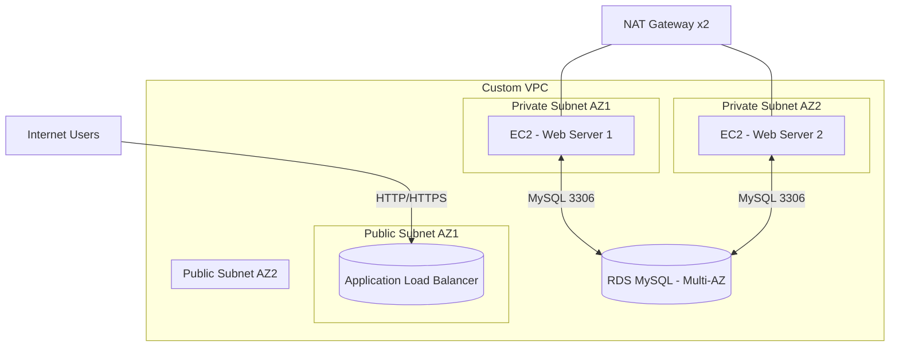

# Project 4: Deploy a fault-tolerant WordPress site using EC2, an Application Load Balancer (ALB), and an RDS Multi-AZ database in a custom VPC

## 1. Objective
Build and understand a highly available, fault-tolerant WordPress web application on AWS. You'll create a custom VPC spanning two Availability Zones, deploy an Application Load Balancer in public subnets, place stateless EC2 web servers in an Auto Scaling Group across private subnets, and connect them to a Multi-AZ Amazon RDS MySQL database. You'll learn core SAA concepts: high availability vs. fault tolerance, stateless architecture, VPC networking, security groups, IAM roles, and elasticity with ALB + ASG.

## 2. AWS Services Used
- Amazon VPC (VPC, Subnets, Route Tables, Internet Gateway, NAT Gateway, Elastic IP)
- Amazon EC2 (Launch Template, Auto Scaling Group)
- Application Load Balancer (Elastic Load Balancing)
- Amazon RDS for MySQL (Multi-AZ)
- AWS Systems Manager (Session Manager)
- AWS IAM (Roles, Policies, Instance Profiles)
- Amazon CloudWatch (Logs/Monitoring)

## 3. Difficulty
Intermediate

## 4. Architecture Diagram


## 5. Prerequisites
- AWS account with billing enabled and a user with AdministratorAccess (for the lab only).
- Basic familiarity with web apps is helpful but not required.
- Ensure you have completed the initial setup detailed in the main [PREREQUISITES.md](../PREREQUISITES.md) file in the repository root.

## 6. Step-by-Step Guide
Follow these numbered steps exactly. Console labels may vary slightly by Region; these steps reflect the AWS Console as of late 2025.

1) VPC and Networking Setup
1. Navigate to the **VPC** service. In the left navigation, click **Your VPCs**.
2. Click **Create VPC**.
3. For **Resources to create**, choose **VPC and more**.
4. In **Name tag auto-generation**, enter `wp4`.
5. For **IPv4 CIDR block**, enter `10.0.0.0/16`.
6. For **Number of Availability Zones**, choose **2**.
7. For **Number of public subnets**, choose **2**.
8. For **Number of private subnets**, choose **2**.
9. For **NAT gateways ($)**, select **1 per AZ** (recommended for HA; costs apply). For low cost demo, you may choose **None** but outbound internet from private subnets will break.
10. For **VPC endpoints**, leave default.
11. Click **Create VPC** and wait until status shows **Complete**. Note the created resource names (e.g., `wp4-vpc`, `wp4-public-az1`, `wp4-private-az1`, route tables, IGW, NAT, etc.).

2) Database Layer (DB Subnet Group + RDS MySQL Multi-AZ)
1. Go to **RDS** > **Subnet groups** (left menu under **Network & security**).
2. Click **Create DB subnet group**.
3. Name: `wp4-db-subnet-group` | Description: `DB subnets for WordPress` | VPC: select `wp4-vpc`.
4. For **Availability Zones**, select the two AZs used by the VPC wizard.
5. For **Subnets**, select the two private subnets (one in each AZ). Click **Create**.
6. In **Databases**, click **Create database**.
7. Choose **Standard create**.
8. **Engine options**: Select **MySQL**.
9. **Version**: choose the latest MySQL 8.0 compatible.
10. **Templates**: choose **Production** (enables Multi-AZ). Ensure **Multi-AZ DB instance** is checked. If instead using the newer **Multi-AZ DB cluster**, you can choose that too; this guide assumes Multi-AZ instance for simplicity.
11. **Settings**:
   - DB instance identifier: `wp4-mysql`
   - Master username: `wpadmin`
   - Master password: enter a strong password, e.g. `Wp4-Admin-StrongP@ssw0rd!` and confirm.
12. **Instance configuration**:
   - DB instance class: choose a burstable class, e.g., `db.t3.micro` or `db.t4g.micro` (ARM requires Graviton-compatible clients; x86 is fine).
13. **Storage**:
   - Storage type: **gp3**
   - Allocated: **20 GiB**
   - Disable storage autoscaling (optional for cost).
14. **Availability & durability**: Ensure **Multi-AZ** is enabled.
15. **Connectivity**:
   - VPC: select `wp4-vpc`
   - Compute resource: leave default.
   - DB subnet group: select `wp4-db-subnet-group`
   - Public access: **No**
   - VPC security group: select an existing SG or click **Create new** placeholder; we will attach the DB SG later. For now choose **Create new** and name it `wp4-db-sg` allowing no inbound (we will edit soon).
   - Availability Zone: No preference.
16. **Database authentication**: Password authentication.
17. **Additional configuration**:
   - Initial database name: `wordpress`
   - DB parameter group: default
   - Backup: keep defaults (7 days). For cost savings, reduce as desired.
   - Monitoring/Log exports: optional.
18. Click **Create database**. Wait until status is **Available**. Note the **Endpoint** (e.g., `wp4-mysql.xxxxx.us-east-1.rds.amazonaws.com`) and **Port 3306**.

3) Application Layer Security (Security Groups)
1. Go to **EC2** > **Security Groups**.
2. Click **Create security group**. Create three SGs in the same VPC `wp4-vpc`:
   - ALB SG: Name `wp4-alb-sg`. Inbound rules:
     - Type: **HTTP** Port `80` Source: `0.0.0.0/0` and `::/0`
     - Optional: **HTTPS** Port `443` Source: `0.0.0.0/0` and `::/0` (if you plan to add an ACM cert; otherwise skip)
     Outbound: default allow all.
   - Web SG: Name `wp4-web-sg`. Inbound rules:
     - Type: **HTTP** Port `80` Source: `wp4-alb-sg` (choose **Custom** then select the SG ID)
     - Optional: **HTTPS** Port `443` Source: `wp4-alb-sg`
     - Optional for SSM Agent updates: **HTTPS (443)** Source: `0.0.0.0/0` (not needed if NAT provides egress)
     Outbound: allow all (needed for package installs via NAT).
   - DB SG: Name `wp4-db-sg` (edit existing if created by RDS). Inbound rules:
     - Type: **MySQL/Aurora** Port `3306` Source: `wp4-web-sg` (select by SG ID)
     Outbound: default.

4) IAM Role for SSM
1. Go to **IAM** > **Roles** > **Create role**.
2. **Trusted entity type**: **AWS service**. Use case: **EC2**.
3. Click **Next** to permissions.
4. Search and check **AmazonSSMManagedInstanceCore**.
5. Optional: Click **Create policy**, switch to **JSON**, paste contents of `assets/iam_ssm_policy.json`, name `wp4-ssm-inline`, create, and attach instead. Using the AWS managed policy is recommended.
6. Click **Next** to name.
7. Role name: `wp4-ec2-ssm-role`. Create role.
8. Go to **IAM** > **Instance profiles** and confirm an instance profile with the same name exists; if not, create instance profile and add the role.

5) Launch Template
1. Go to **EC2** > **Launch Templates** > **Create launch template**.
2. Launch template name: `wp4-launch-template`.
3. Source template: None.
4. Amazon Machine Image (AMI): Choose the latest **Amazon Linux 2 AMI (HVM), SSD Volume Type**.
5. Instance type: `t2.micro` or `t3.micro`.
6. Key pair: **Do not include** (we'll use SSM Session Manager; no SSH needed).
7. Network settings: Leave unset here (will be chosen by the ASG).
8. Security groups: Select `wp4-web-sg`.
9. Storage: Keep default 8 GiB gp3, or set 16 GiB if desired.
10. Resource tags: Add `Name=wp4-web`.
11. Advanced details:
    - IAM instance profile: select `wp4-ec2-ssm-role`.
    - User data: open `assets/user_data.sh` and paste its entire content here. Then replace the placeholders with your actual DB details or pass env vars via the script header. For example set:
      - `WORDPRESS_DB_NAME=wordpress`
      - `WORDPRESS_DB_USER=wpadmin` (or a dedicated app user you create on the DB)
      - `WORDPRESS_DB_PASSWORD=<your RDS master/admin password or app user password>`
      - `WORDPRESS_DB_HOST=<your RDS endpoint>`
    - To pass env values inline, put them before the script body, e.g.:
```
#!/bin/bash
WORDPRESS_DB_NAME=wordpress
WORDPRESS_DB_USER=wpadmin
WORDPRESS_DB_PASSWORD=YourStrongPass
WORDPRESS_DB_HOST=wp4-mysql.xxxxxx.us-east-1.rds.amazonaws.com
# paste the rest of user_data.sh here
```
12. Create launch template.

6) Auto Scaling Group
1. Go to **EC2** > **Auto Scaling Groups** > **Create Auto Scaling group**.
2. Name: `wp4-asg`.
3. Choose launch template: select `wp4-launch-template`. Click **Next**.
4. Network: VPC `wp4-vpc`.
5. Subnets: Select the two private subnets (one in each AZ).
6. Load balancing: Choose **Attach to an existing load balancer later** for now (we'll attach via target group), or select **Attach to a new load balancer** and choose **Application Load Balancer**. For clarity, choose later and continue.
7. Health checks: **EC2** (or **ELB** once ALB is attached). Health check grace period: `300` seconds.
8. Desired capacity: `2` | Minimum: `2` | Maximum: `4`.
9. Scaling policies: None for now (manual). Click **Next** through notifications/tags as desired, then **Create Auto Scaling group**.

7) Load Balancer (ALB + Target Group)
1. Go to **EC2** > **Target Groups** > **Create target group**.
2. Target type: **Instances** (or **IP** if preferred). Name: `wp4-tg`.
3. Protocol: **HTTP** Port `80`. VPC: `wp4-vpc`.
4. Health checks: Path `/health.html`. Healthy threshold `2`, Unhealthy threshold `2`, Timeout `5`, Interval `30`.
5. Click **Next** and do not register targets yet (the ASG will register automatically). Click **Create target group**.
6. Go to **EC2** > **Load Balancers** > **Create load balancer** > **Application Load Balancer**.
7. Name: `wp4-alb`. Scheme: **Internet-facing**. IP address type: **IPv4**.
8. Network mapping: Select the two public subnets created by the VPC wizard (one per AZ).
9. Security groups: Select `wp4-alb-sg`.
10. Listeners and routing: Listener **HTTP:80**. Default action: **Forward to** `wp4-tg`.
11. Click **Create load balancer** and wait for status **Active**.
12. Attach ASG to Target Group: Go to **Auto Scaling Groups** > open `wp4-asg` > **Automatic scaling** > **Load balancing** > **Edit** > check **Attach to a load balancer** and select `wp4-tg`. Save. Alternatively, in the target group, register the instances once they show up.

8) Testing
1. In **EC2** > **Load Balancers**, open `wp4-alb`. Copy the **DNS name** (e.g., `wp4-alb-123456.us-east-1.elb.amazonaws.com`).
2. Open the DNS name in your browser. You should see the WordPress setup page.
3. Complete the setup by entering:
   - Site Title: any
   - Username: `admin`
   - Password: a strong password
   - Email: your email
4. Log in to confirm the site works. Try stopping one instance or one AZ; traffic should continue via ALB and the ASG should replace instances.

## 7. Learning Materials & Key Concepts
- Concept 1: High Availability vs. Fault Tolerance: This design spreads resources across AZs (ALB subnets, ASG subnets) and uses RDS Multi-AZ for automatic failover. ALB + ASG provide availability, while Multi-AZ improves fault tolerance at the database layer.
- Concept 2: Stateful vs. Stateless Application Tiers: EC2 web servers are stateless; they serve PHP code and fetch state from RDS. If an instance is terminated, no user data is lost because state persists in the DB. WordPress media can be offloaded to S3 for full statelessness.
- Concept 3: VPC Networking and Security: Public subnets host internet-facing ALB and NAT gateways. Private subnets host EC2 and RDS without public IPs. Security Groups are stateful and only allow necessary flows (ALB->Web 80/443, Web->DB 3306).
- Concept 4: Scalability & Elasticity: ALB distributes traffic and monitors health. ASG scales instance count based on demand or health, replacing unhealthy nodes automatically.

## 8. Cost & Free Tier Eligibility
- Free Tier: EC2 t2.micro/t3.micro may be eligible under Free Tier hours. However, RDS Multi-AZ and NAT Gateways are NOT free tier eligible. ALB has hourly and LCU charges. Data transfer within same AZ may incur charges.
- Potential Costs: Primary costs come from RDS Multi-AZ instance hours and NAT Gateways (per-hour + data). ALB hourly cost also applies. To minimize cost, do the lab in the smallest region pricing and delete resources immediately after testing.

## 9. Cleanup Instructions
Follow this order to avoid dependency errors and stop all charges:
1. Delete Application Load Balancer: **EC2** > **Load Balancers** > select `wp4-alb` > **Actions** > **Delete**.
2. Delete Auto Scaling Group: **EC2** > **Auto Scaling Groups** > select `wp4-asg` > **Delete**. Confirm. Wait for instance termination.
3. Delete Launch Template: **EC2** > **Launch Templates** > select `wp4-launch-template` > **Actions** > **Delete template**.
4. Delete RDS Database: **RDS** > **Databases** > select `wp4-mysql` > **Actions** > **Delete** > uncheck **Create final snapshot** and check **I acknowledge** > **Delete**.
5. Release Elastic IP: **VPC** > **Elastic IP addresses** > select EIP used by NAT Gateways > **Actions** > **Release**.
6. Delete NAT Gateway: **VPC** > **NAT Gateways** > select gateway(s) > **Actions** > **Delete**.
7. Delete Internet Gateway: **VPC** > **Internet Gateways** > select the IGW attached to `wp4-vpc` > **Actions** > **Detach from VPC** > then **Delete**.
8. Delete VPC: **VPC** > **Your VPCs** > select `wp4-vpc` > **Actions** > **Delete VPC** (this also deletes subnets and route tables).

## 10. Associated Project Files
- `assets/user_data.sh` – EC2 User Data script to install Apache/PHP, download and configure WordPress, and connect to RDS.
- `assets/iam_ssm_policy.json` – IAM policy enabling SSM Session Manager connectivity for EC2 (alternative to opening SSH).
