# Project 4: Deploy a fault-tolerant WordPress site using EC2, an Application Load Balancer (ALB), and an RDS Multi-AZ database in a custom VPC

## 1. Objective
In this project, you will build a highly available, fault-tolerant WordPress website that can withstand the failure of individual components. You'll learn how to design and implement a resilient architecture using multiple Availability Zones, an Application Load Balancer for traffic distribution, Auto Scaling for automatic recovery, and an RDS Multi-AZ database for data redundancy. This project demonstrates core principles of the AWS Well-Architected Framework, particularly the Reliability and Security pillars.

## 2. AWS Services Used
- **Amazon VPC** - Custom networking environment with public and private subnets
- **Amazon EC2** - Web servers hosting WordPress
- **Application Load Balancer (ALB)** - Traffic distribution and health checking
- **Auto Scaling Group** - Automatic instance replacement and scaling
- **Amazon RDS (MySQL)** - Multi-AZ database for high availability
- **Amazon Route 53** - DNS resolution (optional)
- **AWS Systems Manager Session Manager** - Secure instance access
- **Security Groups** - Network-level security controls
- **IAM** - Identity and access management

## 3. Difficulty
**Intermediate**

## 4. Architecture Diagram

```mermaid
graph TB
    subgraph "AWS Cloud"
        subgraph "VPC (10.0.0.0/16)"
            subgraph "Public Subnets"
                ALB[Application Load Balancer]
                NAT[NAT Gateway]
            end
            
            subgraph "Private Subnets"
                subgraph "Auto Scaling Group"
                    EC2A[EC2 Instance<br/>AZ-1a]
                    EC2B[EC2 Instance<br/>AZ-1b]
                end
                
                subgraph "RDS Subnet Group"
                    RDS[(RDS MySQL<br/>Multi-AZ)]
                end
            end
            
            IGW[Internet Gateway]
        end
    end
    
    Users[👥 Users] --> IGW
    IGW --> ALB
    ALB --> EC2A
    ALB --> EC2B
    EC2A --> RDS
    EC2B --> RDS
    EC2A -.-> NAT
    EC2B -.-> NAT
    NAT --> IGW
    
    classDef publicSubnet fill:#e1f5fe
    classDef privateSubnet fill:#f3e5f5
    classDef database fill:#fff3e0
    classDef loadbalancer fill:#e8f5e8
    
    class ALB,NAT publicSubnet
    class EC2A,EC2B privateSubnet
    class RDS database
```



### 🏗️ **What You'll Build:**
- **High Availability**: Multi-AZ deployment protects against datacenter failures
- **Auto Scaling**: Automatically replaces failed instances and handles traffic spikes
- **Load Balancing**: Distributes traffic evenly across healthy instances
- **Database Resilience**: Multi-AZ RDS with automatic failover
- **Security**: Private subnets with no direct internet access

## 5. Prerequisites
- Ensure you have completed the initial setup detailed in the main [PREREQUISITES.md](../PREREQUISITES.md) file in the repository root.

## 6. Step-by-Step Guide

> **💡 Pro Tip**: Keep the AWS Console open in multiple tabs as you'll be switching between VPC, EC2, RDS, and IAM services frequently.

### 🌐 Phase 1: VPC and Networking Setup

#### ✅ Step 1: Create VPC
1. **Navigate to VPC Console**:
   - In the AWS Console search bar, type `VPC` and click **VPC**
   - Click **Create VPC** (big orange button)

2. **Configure VPC Settings**:
   ```
   📋 VPC Configuration Checklist:
   ✅ VPC and more: ✓ (Select this option for easier setup)
   ✅ Name tag auto-generation: wordpress
   ✅ IPv4 CIDR block: 10.0.0.0/16
   ✅ IPv6 CIDR block: No IPv6 CIDR block
   ✅ Tenancy: Default
   ✅ Number of Availability Zones: 2
   ✅ Number of public subnets: 2
   ✅ Number of private subnets: 2
   ✅ NAT gateways: 1 per AZ
   ✅ VPC endpoints: None
   ```

3. **Review and Create**:
   - Scroll down and click **Create VPC**
   - ⏱️ **Wait time**: ~2-3 minutes for all resources to be created

> **📝 Note**: The "VPC and more" option automatically creates subnets, route tables, internet gateway, and NAT gateways for you!

#### ✅ Step 2: Verify Subnet Configuration
After creation, verify your subnets are correctly configured:

**Expected Subnets**:
| Subnet Name | Type | CIDR | Availability Zone |
|-------------|------|------|------------------|
| wordpress-subnet-public1-{az} | Public | 10.0.0.0/24 | First AZ |
| wordpress-subnet-public2-{az} | Public | 10.0.1.0/24 | Second AZ |
| wordpress-subnet-private1-{az} | Private | 10.0.128.0/24 | First AZ |
| wordpress-subnet-private2-{az} | Private | 10.0.129.0/24 | Second AZ |

### 🔒 Phase 2: Security Groups

#### ✅ Step 3: Create Security Groups
1. **Navigate to EC2 Console** → **Security Groups** (left sidebar)

2. **Create ALB Security Group**:
   ```
   📋 ALB Security Group Configuration:
   ✅ Security group name: wordpress-alb-sg
   ✅ Description: Security group for WordPress Application Load Balancer
   ✅ VPC: Select wordpress-vpc
   
   Inbound Rules:
   ✅ Type: HTTP (80) | Source: Anywhere-IPv4 (0.0.0.0/0)
   ✅ Type: HTTPS (443) | Source: Anywhere-IPv4 (0.0.0.0/0)
   
   Outbound Rules: (Leave default - All traffic to 0.0.0.0/0)
   ```

3. **Create EC2 Security Group**:
   ```
   📋 EC2 Security Group Configuration:
   ✅ Security group name: wordpress-ec2-sg
   ✅ Description: Security group for WordPress EC2 instances
   ✅ VPC: Select wordpress-vpc
   
   Inbound Rules:
   ✅ Type: HTTP (80) | Source: wordpress-alb-sg
   ✅ Type: HTTPS (443) | Source: wordpress-alb-sg
   
   Outbound Rules: (Leave default)
   ```

4. **Create RDS Security Group**:
   ```
   📋 RDS Security Group Configuration:
   ✅ Security group name: wordpress-rds-sg
   ✅ Description: Security group for WordPress RDS database
   ✅ VPC: Select wordpress-vpc
   
   Inbound Rules:
   ✅ Type: MySQL/Aurora (3306) | Source: wordpress-ec2-sg
   
   Outbound Rules: (Leave default)
   ```

> **🔐 Security Best Practice**: Notice how we're using security group references instead of IP addresses. This creates a chain of trust: Internet → ALB → EC2 → RDS.

### 🗄️ Phase 3: Database Setup

#### ✅ Step 4: Create RDS Subnet Group
1. **Navigate to RDS Console** → **Subnet groups** (left sidebar)
2. **Click Create DB subnet group**:
   ```
   📋 DB Subnet Group Configuration:
   ✅ Name: wordpress-db-subnet-group
   ✅ Description: Subnet group for WordPress database
   ✅ VPC: wordpress-vpc
   ✅ Availability Zones: Select both AZs from your region
   ✅ Subnets: Select both PRIVATE subnets only
   ```

#### ✅ Step 5: Create RDS Database
1. **Navigate to RDS Console** → **Databases** → **Create database**

2. **Engine Selection**:
   ```
   📋 Database Engine:
   ✅ Engine type: MySQL
   ✅ Edition: MySQL Community
   ✅ Version: MySQL 8.0.35 (or latest)
   ```

3. **Templates**: Select **Production** (enables Multi-AZ automatically)

4. **Settings**:
   ```
   📋 Database Settings:
   ✅ DB instance identifier: wordpress-db
   ✅ Master username: admin
   ✅ Password: [Create a strong password and save it securely]
   ```

5. **Instance Configuration**:
   ```
   📋 Instance Configuration:
   ✅ DB instance class: Burstable classes → db.t3.micro
   ```

6. **Storage**:
   ```
   📋 Storage Configuration:
   ✅ Storage type: General Purpose SSD (gp2)
   ✅ Allocated storage: 20 GiB
   ✅ Enable storage autoscaling: ✓
   ```

7. **Connectivity**:
   ```
   📋 Connectivity Configuration:
   ✅ VPC: wordpress-vpc
   ✅ DB subnet group: wordpress-db-subnet-group
   ✅ Public access: No
   ✅ VPC security groups: Choose existing → wordpress-rds-sg
   ✅ Availability Zone: No preference
   ```

8. **Additional Configuration**:
   ```
   📋 Additional Configuration:
   ✅ Initial database name: wordpress
   ✅ DB parameter group: default.mysql8.0
   ✅ Backup retention period: 7 days
   ✅ Enable encryption: ✓ (recommended)
   ```

9. **Click Create database**
   - ⏱️ **Wait time**: ~10-15 minutes for Multi-AZ deployment

> **💾 Important**: Copy the RDS endpoint URL once the database is created. You'll need it for the user data script.

### 👤 Phase 4: IAM Role for EC2

#### ✅ Step 6: Create IAM Policy
1. **Navigate to IAM Console** → **Policies** → **Create policy**
2. **Click JSON tab** and paste the content from `assets/iam_ssm_policy.json`
3. **Policy Configuration**:
   ```
   📋 Policy Configuration:
   ✅ Policy name: WordPressSSMPolicy
   ✅ Description: Allows EC2 instances to be managed via Systems Manager
   ```

#### ✅ Step 7: Create IAM Role
1. **Navigate to IAM Console** → **Roles** → **Create role**
2. **Role Configuration**:
   ```
   📋 Role Configuration:
   ✅ Trusted entity type: AWS service
   ✅ Use case: EC2
   ✅ Permissions policies: WordPressSSMPolicy
   ✅ Role name: WordPressEC2Role
   ✅ Description: IAM role for WordPress EC2 instances
   ```

### 🚀 Phase 5: Launch Template and Auto Scaling

#### ✅ Step 8: Create Launch Template
1. **Navigate to EC2 Console** → **Launch Templates** → **Create launch template**

2. **Template Configuration**:
   ```
   📋 Launch Template Configuration:
   ✅ Launch template name: wordpress-launch-template
   ✅ Template version description: WordPress LAMP stack template
   ✅ Auto Scaling guidance: ✓ Provide guidance
   ```

3. **Application and OS Images**:
   ```
   📋 AMI Configuration:
   ✅ Quick Start: Amazon Linux
   ✅ Amazon Machine Image: Amazon Linux 2023 AMI
   ✅ Architecture: 64-bit (x86)
   ```

4. **Instance Type**: `t3.micro` (Free Tier eligible)

5. **Key pair**: **Don't include in launch template** (we'll use SSM)

6. **Network Settings**:
   ```
   📋 Network Configuration:
   ✅ Subnet: Don't include in launch template
   ✅ Security groups: wordpress-ec2-sg
   ```

7. **Advanced Details**:
   ```
   📋 Advanced Configuration:
   ✅ IAM instance profile: WordPressEC2Role
   ✅ User data: [Copy from assets/user_data.sh]
   ```

> **🔧 Critical**: In the user data script, replace:
> - `REPLACE_WITH_RDS_ENDPOINT` with your actual RDS endpoint
> - `REPLACE_WITH_DB_PASSWORD` with your database password

#### ✅ Step 9: Create Auto Scaling Group
1. **Navigate to EC2 Console** → **Auto Scaling Groups** → **Create Auto Scaling group**

2. **Auto Scaling Group Configuration**:
   ```
   📋 Auto Scaling Configuration:
   ✅ Auto Scaling group name: wordpress-asg
   ✅ Launch template: wordpress-launch-template (Latest)
   ```

3. **Network Configuration**:
   ```
   📋 Network Configuration:
   ✅ VPC: wordpress-vpc
   ✅ Subnets: Select BOTH private subnets
   ```

4. **Load Balancing** (we'll configure this in the next phase):
   ```
   📋 Load Balancing:
   ✅ Load balancing: Attach to a new load balancer
   ✅ Load balancer type: Application Load Balancer
   ✅ Load balancer name: wordpress-alb
   ✅ Load balancer scheme: Internet-facing
   ✅ Network mapping: Select both public subnets
   ```

5. **Health Checks**:
   ```
   📋 Health Check Configuration:
   ✅ Health check type: ELB
   ✅ Health check grace period: 300 seconds
   ```

6. **Group Size**:
   ```
   📋 Group Size Configuration:
   ✅ Desired capacity: 2
   ✅ Minimum capacity: 2
   ✅ Maximum capacity: 4
   ```

### ⚖️ Phase 6: Application Load Balancer Configuration

#### ✅ Step 10: Configure Load Balancer Details
During the Auto Scaling Group creation, the ALB is automatically configured. Verify these settings:

1. **Load Balancer Configuration**:
   ```
   📋 ALB Configuration:
   ✅ Target group name: wordpress-asg-1 (auto-generated)
   ✅ Protocol: HTTP
   ✅ Port: 80
   ✅ Health check path: /health.html
   ✅ Health check interval: 30 seconds
   ✅ Healthy threshold: 2
   ✅ Unhealthy threshold: 2
   ```

2. **Complete Auto Scaling Group Creation**

### 🧪 Phase 7: Testing and Verification

#### ✅ Step 11: Monitor Deployment
1. **Check Auto Scaling Group**:
   - Go to **EC2 Console** → **Auto Scaling Groups**
   - Select `wordpress-asg` → **Activity** tab
   - Wait for instances to launch (Status: "Successful")

2. **Check Target Group Health**:
   - Go to **EC2 Console** → **Target Groups**
   - Select the auto-generated target group
   - **Targets** tab → Wait for "healthy" status
   - ⏱️ **Wait time**: 5-10 minutes for health checks to pass

3. **Get Load Balancer DNS**:
   - Go to **EC2 Console** → **Load Balancers**
   - Copy the **DNS name** of your ALB

#### ✅ Step 12: Access WordPress
1. **Open your browser** and navigate to the ALB DNS name
2. **WordPress Setup Page** should appear:
   ```
   📋 WordPress Setup:
   ✅ Language: Select your preferred language
   ✅ Site Title: Enter your site name
   ✅ Username: Create admin username
   ✅ Password: Create strong password
   ✅ Email: Enter your email
   ✅ Click "Install WordPress"
   ```

#### ✅ Step 13: Test Fault Tolerance
1. **Go to EC2 Console** → **Instances**
2. **Select one instance** → **Instance state** → **Terminate instance**
3. **Monitor Auto Scaling Group**:
   - Check **Activity** tab for replacement instance launch
   - Verify website remains accessible during replacement
4. **Verify Target Group**:
   - Confirm new instance becomes "healthy"

## 7. Troubleshooting Common Issues

> **🔧 Debugging Toolkit**: Always check these logs first:
> - **User Data Logs**: Connect via SSM and run `sudo cat /var/log/user-data.log`
> - **CloudFormation Events**: If using CF, check the events tab
> - **Auto Scaling Activity**: Check the Activity tab in your Auto Scaling Group

### 🚨 Problem 1: ALB shows 503 Service Temporarily Unavailable

**🔍 Potential Causes:**
- Security Group rules blocking ALB → EC2 communication
- EC2 instances failing health checks
- User data script failed during WordPress installation
- Health check path `/health.html` not accessible

**✅ Solutions:**

1. **Verify Security Group Chain**:
   ```bash
   # Check these step by step:
   📋 Security Group Checklist:
   ✅ ALB SG allows HTTP/HTTPS from 0.0.0.0/0
   ✅ EC2 SG allows HTTP/HTTPS from ALB SG (not from 0.0.0.0/0)
   ✅ RDS SG allows MySQL (3306) from EC2 SG
   ```

2. **Check Target Group Health**:
   - Go to **EC2 Console** → **Target Groups** → Select your target group
   - **Targets** tab → Check **Health status** column
   - If "Unhealthy", click on the instance ID to see detailed health check logs

3. **Debug Health Check Endpoint**:
   ```bash
   # Connect to EC2 via SSM Session Manager:
   # Systems Manager → Session Manager → Start session
   
   # Test health check locally:
   curl -I http://localhost/health.html
   
   # Check Apache status:
   sudo systemctl status httpd
   
   # Check if health.html exists:
   ls -la /var/www/html/health.html
   ```

4. **Review User Data Execution**:
   ```bash
   # Check user data logs:
   sudo cat /var/log/user-data.log
   
   # Look for failed commands or error messages
   sudo grep -i error /var/log/user-data.log
   ```

### 🚨 Problem 2: WordPress shows "Error establishing database connection"

**🔍 Potential Causes:**
- RDS security group blocking EC2 connections
- Incorrect database credentials in wp-config.php
- RDS endpoint not properly replaced in user data
- Database still initializing

**✅ Solutions:**

1. **Verify RDS Security Group**:
   ```bash
   📋 RDS Security Group Checklist:
   ✅ Inbound rule: MySQL/Aurora (3306)
   ✅ Source: EC2 Security Group (not IP address)
   ✅ VPC: Same VPC as EC2 instances
   ```

2. **Check Database Configuration**:
   ```bash
   # Connect to EC2 via SSM:
   sudo cat /var/www/html/wp-config.php | grep -A5 -B5 DB_HOST
   
   # Verify the values:
   # DB_NAME should be: wordpress
   # DB_USER should be: admin
   # DB_HOST should be: your-rds-endpoint.region.rds.amazonaws.com
   ```

3. **Test Database Connectivity**:
   ```bash
   # Install MySQL client if not present:
   sudo yum install -y mysql
   
   # Test connection (replace with your actual values):
   mysql -h YOUR_RDS_ENDPOINT -u admin -p wordpress
   
   # If successful, you should see MySQL prompt
   # If failed, check security groups and RDS status
   ```

4. **Verify RDS Status**:
   - Go to **RDS Console** → **Databases**
   - Ensure status is **Available** (not **Creating** or **Modifying**)
   - Check **Connectivity & security** tab for endpoint

### 🚨 Problem 3: EC2 instances terminating immediately after launch

**🔍 Potential Causes:**
- User data script syntax errors causing boot failure
- IAM role missing required permissions
- Network connectivity issues preventing package downloads
- AMI compatibility issues

**✅ Solutions:**

1. **Check Auto Scaling Activity**:
   ```bash
   📋 Auto Scaling Debug Steps:
   ✅ Go to EC2 Console → Auto Scaling Groups
   ✅ Select your ASG → Activity tab
   ✅ Look for "StatusReason" in failed launches
   ✅ Common errors: "Instance failed ELB health checks"
   ```

2. **Review User Data Script Logs**:
   ```bash
   # Launch a single instance manually to debug:
   # EC2 Console → Launch instance → Use same launch template
   # Connect via SSM Session Manager:
   
   # Check cloud-init logs:
   sudo cat /var/log/cloud-init-output.log
   
   # Check our custom user data log:
   sudo cat /var/log/user-data.log
   
   # Look for specific errors:
   sudo journalctl -u cloud-final
   ```

3. **Verify IAM Permissions**:
   ```bash
   # Check if SSM agent is working:
   sudo systemctl status amazon-ssm-agent
   
   # Test SSM connectivity:
   # If you can connect via Session Manager, IAM is working
   # If not, check IAM role attachment
   ```

4. **Test Network Connectivity**:
   ```bash
   # Test internet connectivity (should work via NAT Gateway):
   curl -I http://www.google.com
   
   # Test package manager:
   sudo yum update -y
   
   # If these fail, check:
   # - NAT Gateway configuration
   # - Route table associations
   # - Security group outbound rules
   ```

### 🚨 Problem 4: WordPress loads but plugins/themes won't install

**🔍 Potential Causes:**
- File permissions too restrictive
- PHP configuration issues
- Insufficient disk space
- SELinux blocking file operations

**✅ Solutions:**

1. **Fix WordPress File Permissions**:
   ```bash
   # Connect via SSM and run:
   sudo chown -R apache:apache /var/www/html/
   sudo find /var/www/html/ -type d -exec chmod 755 {} \;
   sudo find /var/www/html/ -type f -exec chmod 644 {} \;
   
   # WordPress needs write access to these directories:
   sudo chmod 755 /var/www/html/wp-content/
   sudo chmod 755 /var/www/html/wp-content/themes/
   sudo chmod 755 /var/www/html/wp-content/plugins/
   sudo chmod 755 /var/www/html/wp-content/uploads/
   ```

2. **Check Disk Space**:
   ```bash
   df -h
   # Ensure / partition has sufficient space (>2GB recommended)
   ```

3. **PHP Configuration**:
   ```bash
   # Check PHP error log:
   sudo tail -f /var/log/php-fpm/www-error.log
   
   # Restart PHP-FPM:
   sudo systemctl restart php-fpm
   ```

### 🚨 Problem 5: Auto Scaling not replacing terminated instances

**🔍 Potential Causes:**
- Auto Scaling Group misconfiguration
- Launch template issues
- Subnet or security group problems
- Service quotas exceeded

**✅ Solutions:**

1. **Check Auto Scaling Configuration**:
   ```bash
   📋 Auto Scaling Checklist:
   ✅ Desired capacity > 0
   ✅ Launch template exists and is valid
   ✅ Subnets are correctly associated
   ✅ IAM service-linked role exists
   ```

2. **Validate Launch Template**:
   - Go to **EC2 Console** → **Launch Templates**
   - Click **Actions** → **Launch instance from template**
   - Try launching manually to identify issues

3. **Check Service Quotas**:
   - Go to **Service Quotas** console
   - Search for "EC2" and check "Running On-Demand instances"
   - Ensure you haven't exceeded your quota

4. **Monitor CloudWatch Events**:
   - Go to **CloudWatch** → **Events** → **Rules**
   - Look for Auto Scaling events and failures

> **💡 Pro Debugging Tip**: Create a CloudWatch dashboard to monitor your WordPress deployment:
> - ALB target health
> - EC2 instance status
> - RDS database connections
> - Auto Scaling group metrics

## 8. Learning Materials & Key Concepts

### High Availability and Fault Tolerance
- **Multi-AZ Architecture**: Deploying resources across multiple Availability Zones protects against AZ-level failures
- **RDS Multi-AZ**: Provides synchronous replication and automatic failover for database high availability
- **Auto Scaling**: Automatically replaces failed instances and maintains desired capacity

### Load Balancing and Health Checks
- **Application Load Balancer**: Distributes incoming traffic across multiple targets and performs health checks
- **Health Checks**: Regular probes to determine if targets are healthy and should receive traffic
- **Target Groups**: Logical grouping of targets for load balancer routing

### VPC Networking Best Practices
- **Public vs Private Subnets**: Public subnets for internet-facing resources, private for internal resources
- **NAT Gateway**: Allows private subnet resources to access the internet for updates while remaining private
- **Security Groups**: Act as virtual firewalls controlling traffic at the instance level

### Security Best Practices
- **Least Privilege**: IAM roles grant only necessary permissions
- **Network Segmentation**: Using security groups and subnets to control traffic flow
- **SSM Session Manager**: Secure access to instances without SSH keys or open ports

### SAA-C03 Exam Topics Covered
- **Design Resilient Architectures**: Multi-AZ deployment, Auto Scaling, fault tolerance
- **High-Performing Architectures**: Load balancing, caching considerations
- **Secure Applications**: VPC design, security groups, IAM roles
- **Cost-Optimized Architectures**: Right-sizing instances, understanding cost implications

## 9. Cost & Free Tier Eligibility

### ⚠️ **Critical Cost Warning** ⚠️

> **🚨 This project will incur charges beyond the Free Tier! Estimated cost: $70-80 USD/month**

| Service | Free Tier Status | Estimated Monthly Cost |
|---------|------------------|----------------------|
| 🟢 **EC2 t3.micro instances** | ✅ Free (750 hrs/month for 12 months) | $0 |
| 🔴 **RDS Multi-AZ db.t3.micro** | ❌ **NOT FREE** | $25-30 |
| 🔴 **NAT Gateway** | ❌ **NOT FREE** | $32 + data processing |
| 🔴 **Application Load Balancer** | ❌ **NOT FREE** | $16 + data processing |
| 🔴 **Data Transfer** | ❌ **NOT FREE** | $5-10 |
| 🟡 **VPC, Security Groups, Route Tables** | ✅ Free | $0 |
| 🟡 **Systems Manager Session Manager** | ✅ Free | $0 |

### 💰 **Cost Breakdown Details**:

**RDS Multi-AZ ($25-30/month)**:
- Single-AZ db.t3.micro: ~$12/month (Free Tier eligible)
- Multi-AZ adds ~$12-18/month for standby instance
- Storage: 20GB GP2 (~$2-3/month)

**NAT Gateway ($32+/month)**:
- Base cost: $32.40/month per NAT Gateway
- Data processing: $0.045 per GB processed
- Consider: 2 NAT Gateways for true HA = $64.80/month

**Application Load Balancer ($16+/month)**:
- Base cost: $16.20/month
- Load Balancer Capacity Units (LCU): ~$5-10/month depending on traffic

### 🎯 **Cost Optimization Strategies**:

1. **For Learning Only**:
   ```bash
   📋 Money-Saving Tips:
   ✅ Complete project in 1-2 days maximum
   ✅ Delete ALL resources immediately after testing
   ✅ Set up billing alerts for $10, $25, $50
   ✅ Use single AZ setup for learning (reduces costs by ~40%)
   ```

2. **Single-AZ Alternative** (Reduces cost to ~$40/month):
   - Use only 1 public and 1 private subnet
   - Use RDS Single-AZ deployment
   - Use 1 NAT Gateway instead of 2
   - ⚠️ **Trade-off**: Eliminates fault tolerance benefits

3. **Development Alternative** (~$15/month):
   - Skip Multi-AZ RDS (use Single-AZ)
   - Use Classic Load Balancer instead of ALB
   - Use single subnet setup
   - ⚠️ **Trade-off**: Not production-ready architecture

### 📊 **Billing Monitoring Setup**:

1. **Create Billing Alerts**:
   ```bash
   📋 Billing Alert Setup:
   ✅ CloudWatch → Billing → Create Alarm
   ✅ Threshold: $10 USD (early warning)
   ✅ Threshold: $25 USD (project cost warning)
   ✅ Threshold: $50 USD (urgent action needed)
   ```

2. **Daily Cost Monitoring**:
   - Check **Billing Dashboard** daily
   - Review **Cost Explorer** for service-by-service breakdown
   - Monitor **AWS Budgets** if configured

3. **Free Tier Usage Monitoring**:
   - Go to **Billing Console** → **Free Tier**
   - Monitor EC2 hours usage (should stay under 750 hours/month)
   - Watch for any Free Tier limit approaches

### 🚨 **Emergency Cost Control**:
If costs are higher than expected:
1. **Immediate Action**: Stop/terminate all EC2 instances
2. **Delete Load Balancer and NAT Gateway** (highest cost items)
3. **Snapshot then delete RDS** (if you want to preserve data)
4. **Keep VPC components** (no cost) for future use

### 💡 **Alternative Learning Approach**:
Consider using **AWS CloudFormation** or **AWS CDK** to script this deployment:
- Faster to deploy and tear down
- Consistent resource creation
- Easier to experiment with different configurations
- Infrastructure as Code best practice

## 10. Cleanup Instructions

> **🚨 CRITICAL**: Follow this exact order to avoid dependency errors and minimize charges!

### ⏱️ **Estimated Cleanup Time**: 15-20 minutes

### 🗂️ **Phase 1: Application Layer Cleanup** (5 minutes)

#### ✅ **Step 1: Scale Down Auto Scaling Group**
```bash
📋 Auto Scaling Group Cleanup:
1. Go to EC2 Console → Auto Scaling Groups
2. Select wordpress-asg
3. Actions → Edit
4. Set Desired capacity: 0
5. Set Minimum capacity: 0
6. Click Update
7. ⏱️ Wait 2-3 minutes for instances to terminate
```

#### ✅ **Step 2: Delete Auto Scaling Group**
```bash
📋 Delete ASG:
1. Select wordpress-asg → Actions → Delete
2. Type "delete" in confirmation box
3. Click Delete
```

#### ✅ **Step 3: Delete Load Balancer**
```bash
📋 Load Balancer Cleanup:
1. Go to EC2 Console → Load Balancers
2. Select wordpress-alb → Actions → Delete load balancer
3. Type "confirm" → Delete
4. ⏱️ Wait 2-3 minutes for deletion
```

#### ✅ **Step 4: Delete Target Group**
```bash
📋 Target Group Cleanup:
1. Go to EC2 Console → Target Groups
2. Select auto-generated target group → Actions → Delete
3. Click Yes, delete
```

#### ✅ **Step 5: Delete Launch Template**
```bash
📋 Launch Template Cleanup:
1. Go to EC2 Console → Launch Templates
2. Select wordpress-launch-template → Actions → Delete template
3. Type "delete" → Delete
```

### 🗄️ **Phase 2: Database Cleanup** (5-8 minutes)

#### ✅ **Step 6: Delete RDS Database**
```bash
📋 RDS Database Cleanup:
1. Go to RDS Console → Databases
2. Select wordpress-db → Actions → Delete
3. ⚠️ UNCHECK "Create final snapshot" (for learning)
4. ⚠️ UNCHECK "Retain automated backups"
5. Type "delete me" in confirmation box
6. Click Delete
7. ⏱️ Wait 5-8 minutes for deletion to complete
```

#### ✅ **Step 7: Delete DB Subnet Group**
```bash
📋 DB Subnet Group Cleanup:
1. Wait for RDS deletion to complete (Step 6)
2. Go to RDS Console → Subnet groups
3. Select wordpress-db-subnet-group → Delete
4. Click Delete
```

### 🌐 **Phase 3: Network Infrastructure Cleanup** (5-7 minutes)

#### ✅ **Step 8: Delete NAT Gateway**
```bash
📋 NAT Gateway Cleanup:
1. Go to VPC Console → NAT Gateways
2. Select NAT Gateway → Actions → Delete NAT gateway
3. Type "delete" → Delete
4. ⏱️ Wait 2-3 minutes
5. Go to EC2 Console → Elastic IPs
6. Select the released Elastic IP → Actions → Release Elastic IP address
7. Click Release
```

#### ✅ **Step 9: Delete Security Groups**
```bash
📋 Security Groups Cleanup (in this order):
1. Go to EC2 Console → Security Groups
2. Delete wordpress-rds-sg (select → Actions → Delete security group)
3. Delete wordpress-ec2-sg
4. Delete wordpress-alb-sg
5. ⚠️ Skip "default" security group (cannot be deleted)
```

#### ✅ **Step 10: Delete VPC and Components**
```bash
📋 VPC Cleanup:
1. Go to VPC Console → Your VPCs
2. Select wordpress-vpc → Actions → Delete VPC
3. This will automatically delete:
   ✅ All subnets
   ✅ Route tables (except default)
   ✅ Internet gateway
   ✅ Network ACLs (except default)
4. Type "delete" → Delete
```

### 👤 **Phase 4: IAM Cleanup** (2 minutes)

#### ✅ **Step 11: Delete IAM Role and Policy**
```bash
📋 IAM Cleanup:
1. Go to IAM Console → Roles
2. Search for "WordPressEC2Role"
3. Select role → Delete role → Yes, delete
4. Go to IAM Console → Policies
5. Search for "WordPressSSMPolicy"
6. Select policy → Actions → Delete → Delete
```

### ✅ **Final Verification Checklist**

```bash
📋 Verification Steps:
✅ EC2 Console → Instances: No wordpress instances running
✅ EC2 Console → Load Balancers: No wordpress ALB
✅ EC2 Console → Auto Scaling Groups: No wordpress ASG
✅ RDS Console → Databases: No wordpress-db
✅ VPC Console → Your VPCs: No wordpress-vpc
✅ EC2 Console → Elastic IPs: No allocated IPs
✅ IAM Console → Roles: No WordPressEC2Role
✅ Billing Dashboard: Check for any ongoing charges
```

### 🚨 **Common Cleanup Issues & Solutions**

**Issue**: "Cannot delete VPC - resource dependencies exist"
```bash
Solution:
1. Check for remaining ENIs (Network Interfaces)
2. EC2 Console → Network Interfaces → Delete orphaned interfaces
3. Check for remaining instances in any state
4. Wait 5 minutes and try VPC deletion again
```

**Issue**: "Cannot delete security group - resource in use"
```bash
Solution:
1. Check which resources are using the security group:
   - EC2 instances
   - Load balancers
   - RDS instances
   - Lambda functions
2. Delete or modify those resources first
3. Try security group deletion again
```

**Issue**: "RDS deletion taking too long"
```bash
Expected: 5-8 minutes for Multi-AZ deletion
If longer: 
1. Check RDS Console → Events tab for status
2. Multi-AZ deletions can take up to 15 minutes
3. Don't proceed with subnet group deletion until complete
```

### 💰 **Post-Cleanup Cost Verification**

1. **Check Billing Dashboard**:
   - Go to Billing Console → Bills
   - Verify no ongoing charges for deleted services
   - Look for any "pending" charges

2. **Monitor for 24-48 hours**:
   - Some charges may appear with delay
   - NAT Gateway and ALB charges may show next day
   - Set up billing alerts if not already done

3. **Final Cost Report**:
   - Total project cost should be under $5-10 if cleaned up same day
   - Most charges will be prorated for actual usage time

> **💡 Pro Tip**: Screenshot your final billing dashboard showing $0 ongoing charges as proof of complete cleanup!

## 11. Associated Project Files

### 📁 **Files in the `assets` folder:**

#### 🛠️ **`user_data.sh`** - EC2 Bootstrap Script
```bash
📋 Script Functionality:
✅ Installs complete LAMP stack (Apache, PHP 8.0, MySQL client)
✅ Downloads and configures latest WordPress
✅ Creates secure file permissions (755/644)
✅ Generates unique WordPress security salts
✅ Configures load balancer compatibility
✅ Creates health check endpoint (/health.html)
✅ Sets up comprehensive logging (/var/log/user-data.log)
✅ Implements error handling and idempotency
✅ Configures log rotation for Apache
```

**Key Features**:
- **Robust Error Handling**: Script exits on any command failure
- **Comprehensive Logging**: All output logged to `/var/log/user-data.log`
- **Network Wait Logic**: Ensures network is ready before package downloads
- **Service Verification**: Confirms Apache and PHP-FPM are running
- **Idempotent Design**: Safe to run multiple times without conflicts

**⚠️ Required Replacements**:
```bash
# Before using, replace these placeholders:
REPLACE_WITH_RDS_ENDPOINT → your-rds-endpoint.region.rds.amazonaws.com
REPLACE_WITH_DB_PASSWORD → your-actual-database-password
```

#### 🔐 **`iam_ssm_policy.json`** - IAM Policy Document
```json
📋 Policy Permissions:
✅ AWS Systems Manager Session Manager access
✅ EC2 instance messaging and communication
✅ CloudWatch Logs integration
✅ Secure shell access without SSH keys
✅ Instance management and monitoring
```

**Security Benefits**:
- **No SSH Keys Required**: Eliminates key management overhead
- **Session Logging**: All SSM sessions can be logged to CloudWatch
- **Least Privilege**: Only grants necessary permissions for management
- **MFA Compatible**: Works with AWS SSO and MFA requirements
- **Audit Trail**: All access is logged in CloudTrail

**Usage Context**:
- Attach to IAM role for EC2 instances
- Enables secure debugging and troubleshooting
- Required for accessing instances in private subnets
- Supports both interactive and automated management

### 🎯 **How These Files Work Together**:

1. **Launch Process**:
   ```
   Launch Template → user_data.sh → WordPress Installation
        ↓
   IAM Role (iam_ssm_policy.json) → SSM Session Manager Access
        ↓
   Health Check Endpoint → ALB Health Verification
        ↓
   Auto Scaling → Instance Replacement on Failure
   ```

2. **Debugging Workflow**:
   ```
   Issue Detected → SSM Session Manager → Connect to Instance
        ↓
   Check /var/log/user-data.log → Identify Problem
        ↓
   Fix Configuration → Test → Verify Health Check
   ```

3. **Security Architecture**:
   ```
   Internet → ALB (Public Subnets) → EC2 (Private Subnets)
        ↓
   No Direct SSH → SSM Session Manager → Secure Access
        ↓
   IAM Role → Least Privilege → Audit Trail
   ```

### 🔧 **Customization Options**:

**For Production Use**:
- Modify `user_data.sh` to use AWS Systems Manager Parameter Store for secrets
- Add CloudWatch agent configuration for detailed monitoring
- Include backup scripts for WordPress content
- Add SSL/TLS certificate configuration for HTTPS

**For Different Regions**:
- No changes needed - scripts are region-agnostic
- Ensure AMI availability in target region
- Verify service availability (all services used are global)

**For Cost Optimization**:
- Modify script to use smaller package installations
- Add conditional logic for development vs. production
- Include resource tagging for cost allocation

### 📚 **Educational Value**:

These files demonstrate:
- **Infrastructure as Code**: Automated, repeatable deployments
- **Security Best Practices**: Least privilege, secure access methods
- **High Availability Patterns**: Multi-AZ, auto-recovery architecture
- **Monitoring and Logging**: Comprehensive observability setup
- **Modern AWS Practices**: Latest tools and recommended approaches

> **💡 Learning Tip**: Study these files alongside the AWS Well-Architected Framework to understand how they implement the five pillars: Security, Reliability, Performance Efficiency, Cost Optimization, and Operational Excellence.
