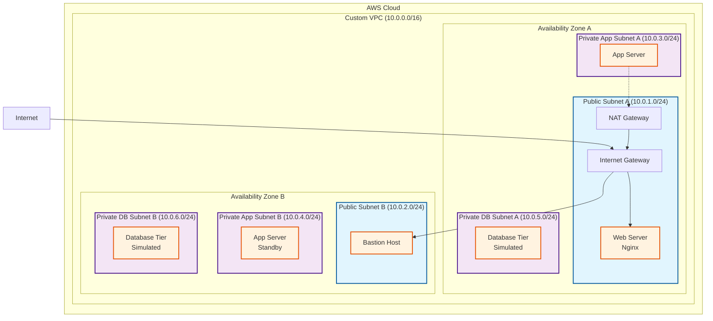

# Project 5: Build a Secure Three-Tier Network Architecture in a Custom VPC

## 1. Objective
In this project, you will build a secure, scalable three-tier network architecture within a custom Amazon Virtual Private Cloud (VPC). You'll learn fundamental networking concepts including subnet design, routing, security groups, and network isolation. The three-tier architecture separates your application into distinct layers: Web Tier (public-facing), Application Tier (business logic), and Database Tier (data storage), each with appropriate security controls and network access patterns.

Key learning outcomes:
- Design and implement a custom VPC with proper CIDR planning
- Create public and private subnets across multiple Availability Zones for high availability
- Configure Internet and NAT Gateways for controlled internet access
- Implement layered security using Security Groups
- Deploy EC2 instances across different tiers with appropriate access controls
- Use AWS Systems Manager Session Manager for secure instance access

## 2. AWS Services Used
- **Amazon VPC**: Virtual Private Cloud for network isolation
- **Amazon EC2**: Elastic Compute Cloud instances for each tier
- **IAM**: Identity and Access Management for secure access
- **AWS Systems Manager**: Session Manager for secure instance management
- **Route Tables**: For network traffic routing
- **Internet Gateway**: For public internet access
- **NAT Gateway**: For outbound internet access from private subnets
- **Security Groups**: Virtual firewalls for instance-level security

## 3. Difficulty
Intermediate

## 4. Architecture Diagram



## 5. Prerequisites
- Ensure you have completed the initial setup detailed in the main [PREREQUISITES.md](../PREREQUISITES.md) file in the repository root.

## 6. Step-by-Step Guide

### Phase 1: VPC and Subnet Creation

#### Step 1.1: Create the Custom VPC
1. Navigate to the **VPC Dashboard** in the AWS Management Console
2. Click **"Create VPC"**
3. Choose **"VPC only"**
4. Configure the VPC:
   - **Name tag**: `ThreeTier-VPC`
   - **IPv4 CIDR block**: `10.0.0.0/16`
   - **IPv6 CIDR block**: No IPv6 CIDR block
   - **Tenancy**: Default
5. Click **"Create VPC"**

#### Step 1.2: Create Six Subnets
Create the following subnets in your VPC:

**Public Subnets (Web Tier):**
1. **Public Subnet A**:
   - **Name**: `Public-Web-Subnet-A`
   - **VPC**: Select your `ThreeTier-VPC`
   - **Availability Zone**: Choose first AZ (e.g., us-east-1a)
   - **IPv4 CIDR block**: `10.0.1.0/24`

2. **Public Subnet B**:
   - **Name**: `Public-Web-Subnet-B`
   - **VPC**: Select your `ThreeTier-VPC`
   - **Availability Zone**: Choose second AZ (e.g., us-east-1b)
   - **IPv4 CIDR block**: `10.0.2.0/24`

**Private App Subnets:**
3. **Private App Subnet A**:
   - **Name**: `Private-App-Subnet-A`
   - **VPC**: Select your `ThreeTier-VPC`
   - **Availability Zone**: Same as Public Subnet A
   - **IPv4 CIDR block**: `10.0.3.0/24`

4. **Private App Subnet B**:
   - **Name**: `Private-App-Subnet-B`
   - **VPC**: Select your `ThreeTier-VPC`
   - **Availability Zone**: Same as Public Subnet B
   - **IPv4 CIDR block**: `10.0.4.0/24`

**Private Database Subnets:**
5. **Private DB Subnet A**:
   - **Name**: `Private-DB-Subnet-A`
   - **VPC**: Select your `ThreeTier-VPC`
   - **Availability Zone**: Same as Public Subnet A
   - **IPv4 CIDR block**: `10.0.5.0/24`

6. **Private DB Subnet B**:
   - **Name**: `Private-DB-Subnet-B`
   - **VPC**: Select your `ThreeTier-VPC`
   - **Availability Zone**: Same as Public Subnet B
   - **IPv4 CIDR block**: `10.0.6.0/24`

### Phase 2: Gateways and Routing

#### Step 2.1: Create and Attach Internet Gateway
1. In the VPC Dashboard, click **"Internet Gateways"**
2. Click **"Create internet gateway"**
3. **Name tag**: `ThreeTier-IGW`
4. Click **"Create internet gateway"**
5. Select the newly created IGW and click **"Actions" → "Attach to VPC"**
6. Select your `ThreeTier-VPC` and click **"Attach internet gateway"**

#### Step 2.2: Create NAT Gateway
1. Click **"NAT Gateways"** in the VPC Dashboard
2. Click **"Create NAT gateway"**
3. Configure:
   - **Name**: `ThreeTier-NAT`
   - **Subnet**: Select `Public-Web-Subnet-A`
   - **Connectivity type**: Public
   - **Elastic IP allocation ID**: Click **"Allocate Elastic IP"**
4. Click **"Create NAT gateway"**

#### Step 2.3: Configure Route Tables
**Create Public Route Table:**
1. Click **"Route Tables"** in VPC Dashboard
2. Click **"Create route table"**
3. Configure:
   - **Name**: `Public-Route-Table`
   - **VPC**: Select `ThreeTier-VPC`
4. Click **"Create route table"**
5. Select the route table and go to **"Routes"** tab
6. Click **"Edit routes"** → **"Add route"**
   - **Destination**: `0.0.0.0/0`
   - **Target**: Select your Internet Gateway
7. Click **"Save changes"**
8. Go to **"Subnet associations"** tab → **"Edit subnet associations"**
9. Select both public subnets and click **"Save associations"**

**Create Private Route Table:**
1. Create another route table:
   - **Name**: `Private-Route-Table`
   - **VPC**: Select `ThreeTier-VPC`
2. Add route for internet access:
   - **Destination**: `0.0.0.0/0`
   - **Target**: Select your NAT Gateway
3. Associate with all four private subnets

### Phase 3: Security Groups

#### Step 3.1: Create Bastion Host Security Group
1. Navigate to **"Security Groups"** in EC2 Dashboard
2. Click **"Create security group"**
3. Configure:
   - **Security group name**: `Bastion-SG`
   - **Description**: `Security group for Bastion Host`
   - **VPC**: Select `ThreeTier-VPC`
4. **Inbound rules**: No rules needed (Session Manager uses HTTPS outbound)
5. **Outbound rules**: Keep default (All traffic to 0.0.0.0/0)

#### Step 3.2: Create Web Tier Security Group
1. Create security group:
   - **Name**: `Web-Tier-SG`
   - **Description**: `Security group for Web Tier`
   - **VPC**: Select `ThreeTier-VPC`
2. **Inbound rules**:
   - **Type**: HTTP, **Port**: 80, **Source**: `0.0.0.0/0`
   - **Type**: HTTPS, **Port**: 443, **Source**: `0.0.0.0/0`
   - **Type**: SSH, **Port**: 22, **Source**: `Bastion-SG` (select the security group)

#### Step 3.3: Create App Tier Security Group
1. Create security group:
   - **Name**: `App-Tier-SG`
   - **Description**: `Security group for Application Tier`
   - **VPC**: Select `ThreeTier-VPC`
2. **Inbound rules**:
   - **Type**: Custom TCP, **Port**: 8080, **Source**: `Web-Tier-SG`
   - **Type**: SSH, **Port**: 22, **Source**: `Bastion-SG`
   - **Type**: All ICMP - IPv4, **Source**: `Bastion-SG` (for ping testing)

#### Step 3.4: Create Database Tier Security Group
1. Create security group:
   - **Name**: `DB-Tier-SG`
   - **Description**: `Security group for Database Tier`
   - **VPC**: Select `ThreeTier-VPC`
2. **Inbound rules**:
   - **Type**: MySQL/Aurora, **Port**: 3306, **Source**: `App-Tier-SG`
   - **Type**: SSH, **Port**: 22, **Source**: `Bastion-SG`
   - **Type**: All ICMP - IPv4, **Source**: `App-Tier-SG`

### Phase 4: IAM Role for SSM Access

#### Step 4.1: Create IAM Role
1. Navigate to **IAM Dashboard** → **"Roles"**
2. Click **"Create role"**
3. **Trusted entity type**: AWS service
4. **Service**: EC2
5. Click **"Next"**
6. **Permissions policies**: Search and select `AmazonSSMManagedInstanceCore`
7. Click **"Next"**
8. **Role name**: `EC2-SSM-Role`
9. Click **"Create role"**

### Phase 5: Launch EC2 Instances

#### Step 5.1: Launch Bastion Host
1. Navigate to **EC2 Dashboard** → **"Launch Instance"**
2. Configure:
   - **Name**: `Bastion-Host`
   - **AMI**: Amazon Linux 2023 AMI
   - **Instance type**: t2.micro
   - **Key pair**: Select your key pair
   - **Network settings**:
     - **VPC**: `ThreeTier-VPC`
     - **Subnet**: `Public-Web-Subnet-B`
     - **Auto-assign public IP**: Enable
     - **Security group**: `Bastion-SG`
   - **Advanced details**:
     - **IAM instance profile**: `EC2-SSM-Role`
3. Click **"Launch instance"**

#### Step 5.2: Launch Web Server
1. Launch another instance:
   - **Name**: `Web-Server`
   - **AMI**: Amazon Linux 2023 AMI
   - **Instance type**: t2.micro
   - **Key pair**: Select your key pair
   - **Network settings**:
     - **VPC**: `ThreeTier-VPC`
     - **Subnet**: `Public-Web-Subnet-A`
     - **Auto-assign public IP**: Enable
     - **Security group**: `Web-Tier-SG`
   - **Advanced details**:
     - **IAM instance profile**: `EC2-SSM-Role`
     - **User data**: Copy the contents of `assets/install_nginx.sh`

#### Step 5.3: Launch App Server
1. Launch another instance:
   - **Name**: `App-Server`
   - **AMI**: Amazon Linux 2023 AMI
   - **Instance type**: t2.micro
   - **Key pair**: Select your key pair
   - **Network settings**:
     - **VPC**: `ThreeTier-VPC`
     - **Subnet**: `Private-App-Subnet-A`
     - **Auto-assign public IP**: Disable
     - **Security group**: `App-Tier-SG`
   - **Advanced details**:
     - **IAM instance profile**: `EC2-SSM-Role`

### Phase 6: Verification

#### Step 6.1: Test Web Server Internet Access
1. Find the public IP of your Web Server instance
2. Open a web browser and navigate to `http://[WEB-SERVER-PUBLIC-IP]`
3. You should see the custom Nginx welcome page

#### Step 6.2: Test Session Manager Access
1. Go to **Systems Manager** → **Session Manager**
2. Click **"Start session"**
3. Select your Bastion Host and click **"Start session"**
4. You should get a command prompt without needing SSH keys

#### Step 6.3: Test Internal Connectivity
1. From the Bastion Host session, ping the App Server:
   ```bash
   ping [APP-SERVER-PRIVATE-IP]
   ```
2. SSH to the App Server (if you have key files):
   ```bash
   ssh ec2-user@[APP-SERVER-PRIVATE-IP]
   ```

## 7. Troubleshooting Common Issues

### Problem 1: The Nginx test page on the web server instance does not load from the internet

**Potential Causes:**
- The public subnet's Route Table does not have a route to the Internet Gateway
- The Web server's Security Group does not allow inbound traffic on Port 80 from `0.0.0.0/0`
- The instance doesn't have a public IP address assigned
- The Internet Gateway is not attached to the VPC

**Solutions:**
1. **Check Route Table Configuration:**
   - Go to VPC → Route Tables
   - Select the route table associated with your public subnet
   - Verify there's a route: `0.0.0.0/0` → Internet Gateway
   - If missing, add the route

2. **Verify Security Group Rules:**
   - Go to EC2 → Security Groups
   - Select the `Web-Tier-SG`
   - Check inbound rules include: HTTP (80) from `0.0.0.0/0`
   - If missing, add the rule

3. **Check Public IP Assignment:**
   - Go to EC2 → Instances
   - Select your Web Server instance
   - Verify it has a public IPv4 address
   - If not, you may need to allocate and associate an Elastic IP

4. **Verify Internet Gateway:**
   - Go to VPC → Internet Gateways
   - Ensure your IGW is attached to the correct VPC

### Problem 2: Cannot connect to the Bastion Host or other instances using Session Manager

**Potential Causes:**
- The instance's IAM Profile is missing the required SSM permissions
- The instance does not have outbound internet access to contact the SSM service endpoint
- The SSM Agent is not running or not updated
- The VPC endpoints for SSM are not configured and internet access is blocked

**Solutions:**
1. **Verify IAM Role and Instance Profile:**
   - Go to IAM → Roles
   - Check that `EC2-SSM-Role` has `AmazonSSMManagedInstanceCore` policy
   - Go to EC2 → Instances → Select instance → Security tab
   - Verify the IAM role is attached

2. **Check Internet Connectivity:**
   - For public subnets: Ensure route to IGW exists
   - For private subnets: Ensure route to NAT Gateway exists
   - Check that security groups allow HTTPS outbound (port 443)

3. **Verify SSM Agent Status:**
   - SSM Agent is pre-installed on Amazon Linux 2023
   - If using older AMIs, you may need to install it manually

4. **Check Systems Manager Prerequisites:**
   - Go to Systems Manager → Fleet Manager
   - Check if your instances appear in the managed instances list
   - If not, wait 5-10 minutes for registration

### Problem 3: Connected to the Bastion, but cannot `ping` or `ssh` to the private app server instance

**Potential Causes:**
- The App server's Security Group does not allow inbound ICMP or SSH traffic from the Bastion Host's Security Group
- The instances are in different VPCs by mistake
- Network ACLs are blocking traffic (if customized)
- Wrong private IP address being used

**Solutions:**
1. **Check App Server Security Group:**
   - Go to EC2 → Security Groups
   - Select `App-Tier-SG`
   - Verify inbound rules include:
     - SSH (22) from `Bastion-SG`
     - All ICMP - IPv4 from `Bastion-SG`
   - If missing, add these rules using the security group ID as source

2. **Verify Instance Placement:**
   - Go to EC2 → Instances
   - Check that both instances are in the same VPC
   - Note the private IP address of the App Server

3. **Test Basic Connectivity:**
   - From Bastion, try: `ping [APP-SERVER-PRIVATE-IP]`
   - Check route table for the private subnet

4. **Alternative Testing Methods:**
   - Use Session Manager to connect directly to the App Server
   - Test connectivity from the App Server back to the Bastion

### Problem 4: NAT Gateway not providing internet access to private instances

**Potential Causes:**
- Route table for private subnets doesn't point to NAT Gateway
- NAT Gateway is in the wrong subnet (should be in public subnet)
- Elastic IP not associated with NAT Gateway
- Security groups blocking outbound traffic

**Solutions:**
1. **Check Private Route Table:**
   - Verify route: `0.0.0.0/0` → NAT Gateway
   - Ensure all private subnets are associated with this route table

2. **Verify NAT Gateway Configuration:**
   - Go to VPC → NAT Gateways
   - Check it's in a public subnet
   - Verify it has an Elastic IP associated

3. **Test from Private Instance:**
   - Connect via Session Manager to App Server
   - Try: `curl https://checkip.amazonaws.com`
   - Should return the NAT Gateway's public IP

## 8. Learning Materials & Key Concepts

### Concept 1: VPC, Subnets, and CIDR
**What it is:** A Virtual Private Cloud (VPC) provides an isolated network environment in AWS where you can launch resources. Subnets are subdivisions of your VPC's IP address range, defined using CIDR (Classless Inter-Domain Routing) notation.

**Why it matters:** 
- VPCs provide security isolation and network control
- Proper CIDR planning prevents IP address conflicts and allows for growth
- Subnets enable you to place resources in different availability zones for high availability

**Best Practices:**
- Use RFC 1918 private IP ranges (10.0.0.0/8, 172.16.0.0/12, 192.168.0.0/16)
- Plan CIDR blocks to avoid overlap with on-premises networks
- Leave room for growth when sizing your VPC and subnets

### Concept 2: Internet Gateway vs. NAT Gateway
**Internet Gateway (IGW):**
- Provides bidirectional internet access
- Allows inbound connections from the internet
- Used in public subnets
- No additional charges

**NAT Gateway:**
- Provides outbound-only internet access
- Prevents inbound connections from the internet
- Used by private subnets for software updates, API calls, etc.
- Charges apply for data processing and hourly usage

**Cost Implications:**
- NAT Gateway costs approximately $0.045/hour + $0.045/GB processed
- Consider VPC endpoints for AWS services to reduce NAT Gateway usage
- Multiple NAT Gateways across AZs increase costs but improve availability

### Concept 3: Security Groups vs. Network ACLs (NACLs)
**Security Groups:**
- **Scope:** Instance-level (virtual firewall for EC2 instances)
- **Type:** Stateful (return traffic automatically allowed)
- **Rules:** Allow rules only (implicit deny all)
- **Evaluation:** All rules evaluated before allowing traffic

**Network ACLs:**
- **Scope:** Subnet-level (apply to all instances in subnet)
- **Type:** Stateless (return traffic must be explicitly allowed)
- **Rules:** Both allow and deny rules
- **Evaluation:** Rules processed in order by rule number

**When to use each:**
- Security Groups: Primary security control, most granular
- NACLs: Additional layer of security, subnet-wide controls

### Concept 4: Bastion Hosts and AWS Systems Manager Session Manager
**Traditional Bastion Host:**
- Jump server in public subnet for accessing private instances
- Requires SSH key management
- Must be hardened and monitored
- Single point of failure

**AWS Systems Manager Session Manager:**
- Browser-based shell access without SSH
- No need for bastion hosts or SSH keys
- Centralized access logging and auditing
- Works through AWS APIs (requires internet access or VPC endpoints)

**Modern Best Practice:**
- Use Session Manager instead of traditional bastion hosts
- More secure, easier to manage, and provides better auditing
- Can eliminate the need for SSH keys in many scenarios

## 9. Cost & Free Tier Eligibility

### Free Tier Coverage:
- **EC2 Instances**: t2.micro instances are covered (750 hours/month)
- **VPC**: No additional charges for VPC, subnets, route tables, or security groups
- **Internet Gateway**: No charges
- **Data Transfer**: 1 GB outbound per month (across all AWS services)

### Billable Components:
- **NAT Gateway**: 
  - $0.045 per hour (~$32.40/month if running continuously)
  - $0.045 per GB of data processed
  - **This is the primary cost driver and is NOT covered by Free Tier**
- **Elastic IP**: $0.005/hour if not attached to a running instance
- **Data Transfer**: Beyond 1 GB outbound per month

### Cost Optimization Tips:
1. **Terminate resources when not in use** - especially the NAT Gateway
2. **Use VPC Endpoints** for AWS services instead of routing through NAT Gateway
3. **Consider single AZ deployment** for learning purposes to reduce NAT Gateway costs
4. **Monitor data transfer** - avoid unnecessary internet traffic from private instances

### Estimated Monthly Cost:
- If running 24/7: ~$35-40/month (primarily NAT Gateway)
- For learning/testing: ~$5-10/month (running only during practice sessions)

## 10. Cleanup Instructions

**⚠️ Important:** Follow this order to avoid dependency errors and additional charges.

### Step 1: Terminate EC2 Instances
1. Go to **EC2 Dashboard** → **Instances**
2. Select all instances created for this project
3. **Actions** → **Instance State** → **Terminate**
4. Wait for all instances to reach "Terminated" state

### Step 2: Delete NAT Gateway
1. Go to **VPC Dashboard** → **NAT Gateways**
2. Select your NAT Gateway
3. **Actions** → **Delete NAT Gateway**
4. Type "delete" to confirm
5. **Note:** This can take several minutes

### Step 3: Release Elastic IP Address
1. Go to **EC2 Dashboard** → **Elastic IPs**
2. Select the Elastic IP used by the NAT Gateway
3. **Actions** → **Release Elastic IP addresses**
4. Confirm the release

### Step 4: Delete VPC (This will delete most components automatically)
1. Go to **VPC Dashboard** → **Your VPCs**
2. Select your `ThreeTier-VPC`
3. **Actions** → **Delete VPC**
4. This will automatically delete:
   - Subnets
   - Route Tables (except main)
   - Internet Gateway
   - Security Groups (except default)

### Step 5: Clean Up IAM Role (Optional)
1. Go to **IAM Dashboard** → **Roles**
2. Select `EC2-SSM-Role`
3. **Delete role** (if not used by other resources)

### Step 6: Verify Cleanup
1. Check that no resources are still running that might incur charges
2. Review your AWS billing dashboard to confirm no ongoing charges

## 11. Associated Project Files

The `assets` folder contains the following files that support this project:

### `install_nginx.sh`
**Purpose:** User data script that automatically installs and configures the Nginx web server on the Web Tier instance.

**Key Features:**
- Updates the Amazon Linux system packages
- Installs and starts the Nginx service
- Creates a custom HTML page that confirms successful deployment
- Provides visual feedback about the three-tier architecture
- Automatically starts on boot for persistent service

**Usage:** Copy the contents of this file into the User Data field when launching the Web Server instance.

### `iam_ssm_policy.json`
**Purpose:** IAM policy document that grants the necessary permissions for AWS Systems Manager Session Manager to function properly.

**Key Permissions:**
- SSM instance communication permissions
- EC2 message handling for Session Manager
- CloudWatch Logs integration for session logging
- S3 access for encryption configuration

**Usage:** This policy is automatically included when you attach the `AmazonSSMManagedInstanceCore` managed policy to your IAM role. The file is provided for reference and custom implementations.

Both files are essential for the proper functioning of the secure three-tier architecture and demonstrate best practices for automated instance configuration and secure access management.
