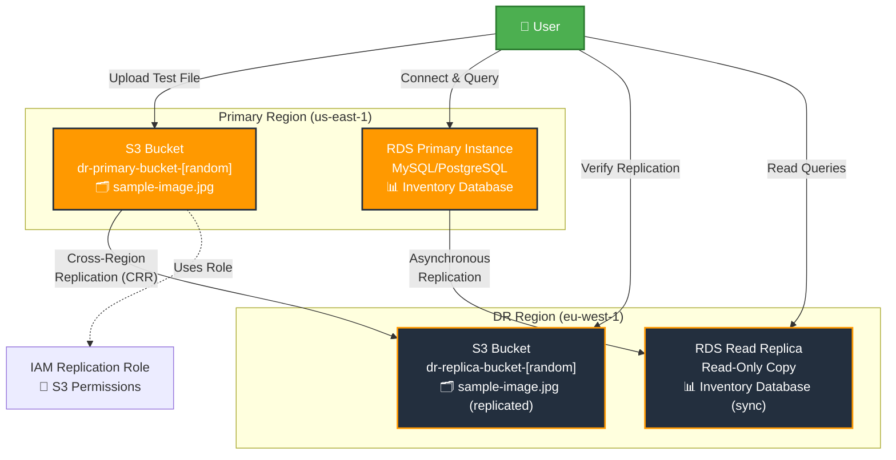

# Project 7: Implement a Cross-Region Disaster Recovery Strategy for S3 and RDS

## 1. Objective
In this project, you will build a comprehensive disaster recovery (DR) strategy by implementing cross-region replication for both object storage (Amazon S3) and relational databases (Amazon RDS). You will learn how to set up automated data replication across different AWS regions to ensure business continuity in case of regional failures. This hands-on experience will teach you key concepts about Recovery Time Objective (RTO), Recovery Point Objective (RPO), and the different approaches to achieve resilience for various types of data workloads.

## 2. AWS Services Used
- **Amazon S3** - Object storage with Cross-Region Replication (CRR)
- **Amazon RDS** - Managed relational database with Cross-Region Read Replicas
- **AWS IAM** - Identity and Access Management for replication permissions
- **AWS VPC** - Virtual Private Cloud (default VPC usage)

## 3. Difficulty
**Intermediate**

## 4. Architecture Diagram



**ASCII Alternative:**
```
┌─────────────────────────────────┐    ┌─────────────────────────────────┐
│        Primary Region           │    │         DR Region               │
│         (us-east-1)             │    │        (eu-west-1)              │
│                                 │    │                                 │
│  ┌─────────────────────────┐    │    │  ┌─────────────────────────┐    │
│  │    S3 Primary Bucket    │────┼────┼──│    S3 Replica Bucket    │    │
│  │   sample-image.jpg      │    │    │  │   sample-image.jpg      │    │
│  └─────────────────────────┘    │    │  └─────────────────────────┘    │
│                                 │    │                                 │
│  ┌─────────────────────────┐    │    │  ┌─────────────────────────┐    │
│  │   RDS Primary Instance  │────┼────┼──│   RDS Read Replica      │    │
│  │   MySQL/PostgreSQL      │    │    │  │   Read-Only Copy        │    │
│  │   Inventory Database    │    │    │  │   Inventory Database    │    │
│  └─────────────────────────┘    │    │  └─────────────────────────┘    │
└─────────────────────────────────┘    └─────────────────────────────────┘
                │                                      │
                └─────────[ IAM Role ]─────────────────┘
                     (S3 Replication Permissions)
```

## 5. Prerequisites
- Ensure you have completed the initial setup detailed in the main [PREREQUISITES.md](../PREREQUISITES.md) file in the repository root.
- **Database Client Access**: You will need either:
  - A SQL client tool (recommended: DBeaver, MySQL Workbench, pgAdmin, or TablePlus)
  - OR access to the AWS RDS Query Editor (available in the AWS Console)
- **Two AWS Regions**: This project requires using two different AWS regions (we'll use us-east-1 and eu-west-1)
- **Public IP Knowledge**: You'll need to know your current public IP address for RDS security group configuration

## 6. Step-by-Step Guide

### Part 1: S3 Cross-Region Replication (CRR) for Disaster Recovery

#### Step 1: Create Source S3 Bucket (Primary Region)
1. **Navigate to S3**: Open the AWS Management Console and go to the S3 service
2. **Create Bucket**: Click "Create bucket"
3. **Configure Bucket**:
   - **Bucket name**: `dr-primary-bucket-[your-initials]-[random-number]` (e.g., `dr-primary-bucket-jd-2025`)
   - **Region**: Select `US East (N. Virginia) us-east-1`
   - **Leave all other settings as default**
4. **Create**: Click "Create bucket"

#### Step 2: Create Destination S3 Bucket (DR Region)
1. **Create Second Bucket**: Click "Create bucket" again
2. **Configure Bucket**:
   - **Bucket name**: `dr-replica-bucket-[your-initials]-[random-number]` (e.g., `dr-replica-bucket-jd-2025`)
   - **Region**: Select `Europe (Ireland) eu-west-1`
   - **Leave all other settings as default**
3. **Create**: Click "Create bucket"

#### Step 3: Enable Versioning on Both Buckets
1. **Select Primary Bucket**: Click on your primary bucket name
2. **Go to Properties**: Click the "Properties" tab
3. **Enable Versioning**:
   - Scroll down to "Bucket Versioning"
   - Click "Edit"
   - Select "Enable"
   - Click "Save changes"
4. **Repeat for Replica Bucket**: Go back to S3 main page and repeat steps 1-3 for the replica bucket

#### Step 4: Configure Cross-Region Replication Rule
1. **Open Primary Bucket**: Click on your primary bucket name
2. **Go to Management Tab**: Click the "Management" tab
3. **Create Replication Rule**:
   - Click "Create replication rule"
   - **Rule name**: `DR-Replication-Rule`
   - **Status**: Enabled
   - **Priority**: 1 (default)
4. **Configure Source**:
   - **Rule scope**: "Apply to all objects in the bucket"
5. **Configure Destination**:
   - **Destination bucket**: "Choose a bucket in this account"
   - **Browse S3**: Click "Browse S3" and select your replica bucket
   - **Destination storage class**: Standard (default)
6. **IAM Role**:
   - Select "Create new role"
   - **Role name**: `S3-Cross-Region-Replication-Role`
7. **Additional Options**:
   - Leave "Replica modification sync" unchecked
   - Leave "Delete marker replication" unchecked
8. **Save**: Click "Save"

#### Step 5: Test S3 Replication
1. **Upload Test File**:
   - Go to the "Objects" tab of your primary bucket
   - Click "Upload"
   - Upload the `sample-image.svg` file from the assets folder (or create a small test image)
   - Click "Upload"
2. **Verify Replication**:
   - Wait 2-5 minutes for replication to complete
   - Navigate to your replica bucket in the eu-west-1 region
   - Verify that the uploaded file appears in the replica bucket
3. **Check Object Details**:
   - Click on the replicated object
   - Note the "Replication status" should show as "REPLICA"

### Part 2: RDS Cross-Region Read Replicas for Disaster Recovery

#### Step 1: Launch Primary RDS Instance
1. **Navigate to RDS**: Go to the RDS service in the AWS Console
2. **Ensure Correct Region**: Verify you're in `us-east-1` (top-right corner)
3. **Create Database**:
   - Click "Create database"
   - **Database creation method**: Standard create
   - **Engine type**: MySQL (or PostgreSQL if preferred)
   - **Engine version**: Use the default latest version
   - **Templates**: Free tier

4. **Instance Configuration**:
   - **DB instance identifier**: `dr-primary-mysql`
   - **Master username**: `admin`
   - **Master password**: Create a strong password (save it securely!)
   - **Confirm password**: Re-enter the same password

5. **Instance Specifications**:
   - **DB instance class**: `db.t3.micro` (Free Tier eligible)
   - **Storage type**: General Purpose SSD (gp2)
   - **Allocated storage**: 20 GB (minimum)

6. **Connectivity**:
   - **VPC**: Default VPC
   - **Public access**: **Yes** (important for this lab)
   - **VPC security group**: Create new
   - **New VPC security group name**: `dr-rds-primary-sg`

7. **Database Authentication**:
   - **Database authentication**: Password authentication

8. **Additional Configuration**:
   - **Initial database name**: `disaster_recovery_test`
   - **Backup retention period**: 7 days (required for read replicas)
   - **Enable automatic backups**: Yes
   - **Backup window**: Default
   - **Enable Enhanced monitoring**: No (to avoid costs)

9. **Create**: Click "Create database"

#### Step 2: Configure Security Group for RDS Access
1. **Wait for Database**: Wait for the database status to show "Available" (5-10 minutes)
2. **Find Your IP Address**: 
   - Go to [whatismyipaddress.com](https://whatismyipaddress.com) to find your public IP
3. **Configure Security Group**:
   - Click on your RDS instance
   - Click on the security group link (e.g., `dr-rds-primary-sg`)
   - Click "Edit inbound rules"
   - Click "Add rule"
   - **Type**: MySQL/Aurora (or PostgreSQL if using PostgreSQL)
   - **Port**: 3306 (or 5432 for PostgreSQL)
   - **Source**: My IP (it should auto-populate your IP)
   - **Description**: `My IP for DR testing`
   - Click "Save rules"

#### Step 3: Connect to Primary Database and Load Sample Data
1. **Get Connection Details**:
   - Go back to your RDS instance
   - Copy the "Endpoint" (e.g., `dr-primary-mysql.xxxxxxxxx.us-east-1.rds.amazonaws.com`)
   - Note the port (3306 for MySQL, 5432 for PostgreSQL)

2. **Connect Using SQL Client** (Recommended):
   - Open your SQL client (DBeaver, MySQL Workbench, etc.)
   - Create new connection:
     - **Host**: Your RDS endpoint
     - **Port**: 3306 (MySQL) or 5432 (PostgreSQL)
     - **Database**: `disaster_recovery_test`
     - **Username**: `admin`
     - **Password**: Your password
   - Test connection and connect

3. **Connect Using RDS Query Editor** (Alternative):
   - In RDS Console, select your database instance
   - Click "Query Editor" in the top menu
   - **Database username**: `admin`
   - **Database password**: Your password
   - **Database name**: `disaster_recovery_test`
   - Click "Connect to database"

4. **Load Sample Data**:
   - Copy the contents of `assets/sample-data.sql`
   - Execute the script in your SQL client or Query Editor
   - Verify data was loaded by running: `SELECT COUNT(*) FROM inventory;`

#### Step 4: Create Cross-Region Read Replica
1. **Select Primary Instance**: In RDS Console, select your primary database instance
2. **Create Read Replica**:
   - Click "Actions" dropdown
   - Select "Create read replica"

3. **Configure Read Replica**:
   - **Destination Region**: Europe (Ireland) eu-west-1
   - **DB instance identifier**: `dr-replica-mysql`
   - **DB instance class**: `db.t3.micro`
   - **Public access**: Yes
   - **VPC security group**: Create new
   - **New VPC security group name**: `dr-rds-replica-sg`

4. **Additional Settings**:
   - **Backup retention period**: 0 (replicas don't need separate backups)
   - **Enhanced monitoring**: Disable

5. **Create**: Click "Create read replica"

#### Step 5: Configure Replica Security Group
1. **Switch to eu-west-1**: Change your AWS Console region to Ireland
2. **Wait for Replica**: Wait for replica status to show "Available" (10-15 minutes)
3. **Configure Security Group**:
   - Go to EC2 → Security Groups
   - Find `dr-rds-replica-sg`
   - Edit inbound rules
   - Add rule: MySQL/Aurora, Port 3306, Source: My IP
   - Save rules

#### Step 6: Verify Read Replica Replication
1. **Get Replica Endpoint**:
   - In RDS Console (eu-west-1 region)
   - Copy the replica's endpoint

2. **Connect to Read Replica**:
   - Use the same connection method as before
   - Use the replica endpoint instead of primary
   - **Important**: This is read-only!

3. **Verify Data Replication**:
   - Run: `SELECT COUNT(*) FROM inventory;`
   - Run: `SELECT * FROM inventory ORDER BY id;`
   - Compare results with primary database

4. **Test Read-Only Nature**:
   - Try to insert a record: `INSERT INTO inventory (product_name, category, quantity, price, location) VALUES ('Test', 'Test', 1, 1.00, 'Test');`
   - This should fail with a read-only error

#### Step 7: Simulate Disaster Recovery - Promote Read Replica
1. **Promote Read Replica**:
   - In RDS Console (eu-west-1), select your read replica
   - Click "Actions" → "Promote read replica"
   - **Backup retention period**: 7 days
   - **Backup window**: Default
   - Click "Promote read replica"

2. **Wait for Promotion**: This takes 5-10 minutes

3. **Test Write Operations**:
   - Once promotion is complete, connect to the now-independent database
   - Run: `INSERT INTO inventory (product_name, category, quantity, price, location) VALUES ('DR Test Product', 'Test Category', 1, 1.00, 'DR Site - EU West');`
   - This should now succeed!

4. **Verify Independence**:
   - The promoted instance is now completely independent
   - Changes to it will NOT replicate back to the original primary
   - This simulates a complete DR failover scenario

## 7. Troubleshooting Common Issues

### Issue 1: S3 Object Replication Not Working
**Problem**: Objects uploaded to the primary bucket don't appear in the replica bucket.

**Potential Causes:**
- Versioning is not enabled on one or both buckets
- IAM role for replication has insufficient permissions
- Replication has a delay (can take 15 minutes for large objects)
- Objects uploaded before replication rule was created won't be replicated

**Solutions:**
1. **Check Versioning**:
   - Go to both buckets → Properties → Bucket Versioning
   - Ensure both show "Enabled"
   - If not enabled, enable it and try uploading a new file

2. **Verify IAM Role**:
   - Go to IAM → Roles → Search for your replication role
   - Check the policy includes permissions for both source and destination buckets
   - The role should have `s3:GetObjectVersionForReplication`, `s3:GetObjectVersionAcl`, and `s3:ReplicateObject` permissions

3. **Check Replication Status**:
   - In the source bucket, click on your uploaded object
   - Look for "Replication status" in the object details
   - Status should be "PENDING", "COMPLETED", or "FAILED"

4. **Time Factor**:
   - Wait up to 15 minutes for replication to complete
   - Replication is not instantaneous

### Issue 2: Cannot Connect to Primary RDS Instance
**Problem**: Connection to RDS instance fails with timeout or connection refused errors.

**Potential Causes:**
- Instance is not set to "Publicly accessible"
- Security group doesn't allow inbound traffic on the database port
- Incorrect IP address in security group
- Database is still in "Creating" status

**Solutions:**
1. **Check Public Access**:
   - Go to RDS → Databases → Select your instance
   - Look at "Connectivity & security" section
   - "Publicly accessible" should be "Yes"
   - If "No", modify the instance to enable public access

2. **Verify Security Group**:
   - Note the security group name from RDS instance details
   - Go to EC2 → Security Groups → Find your security group
   - Check inbound rules include:
     - Type: MySQL/Aurora (port 3306) or PostgreSQL (port 5432)
     - Source: Your current IP address

3. **Update Your IP**:
   - Your IP might have changed
   - Go to [whatismyipaddress.com](https://whatismyipaddress.com)
   - Update the security group rule with your current IP

4. **Check Instance Status**:
   - Instance must be in "Available" status
   - Wait if it's still "Creating" or "Modifying"

### Issue 3: Cannot Create Read Replica
**Problem**: "Create read replica" option is grayed out or creation fails.

**Potential Causes:**
- Automatic backups are not enabled on the primary instance
- Backup retention period is set to 0
- Primary instance is not in "Available" status
- Primary instance has active modifications

**Solutions:**
1. **Enable Automatic Backups**:
   - Select your primary RDS instance
   - Click "Modify"
   - Scroll to "Backup" section
   - Set "Backup retention period" to 7 days
   - Set "Backup window" to a suitable time
   - Click "Continue" → "Modify DB instance"

2. **Wait for Modifications**:
   - Any pending modifications must complete first
   - Wait for instance status to return to "Available"

3. **Check Primary Instance Health**:
   - Ensure primary instance is healthy and accessible
   - No maintenance windows should be active

### Issue 4: Read Replica Shows Lag or Inconsistent Data
**Problem**: Data in read replica doesn't match primary or is significantly delayed.

**Potential Causes:**
- High write activity on primary causing replication lag
- Network connectivity issues between regions
- Primary instance under heavy load

**Solutions:**
1. **Check Replica Lag**:
   - In RDS Console, select your read replica
   - Look for "Replica lag" metric in monitoring
   - Typical lag should be under 1 minute

2. **Monitor Primary Load**:
   - Check primary instance CPU and connection metrics
   - Reduce load on primary if necessary

3. **Wait for Consistency**:
   - RDS replication is asynchronous
   - Some delay is normal, especially during high activity

### Issue 5: Read Replica Promotion Fails
**Problem**: Promoting read replica to standalone instance fails or takes too long.

**Potential Causes:**
- Active replication process
- Backup configuration issues
- Regional service issues

**Solutions:**
1. **Retry Promotion**:
   - Cancel any failed promotion attempts
   - Wait 10 minutes and retry

2. **Check Prerequisites**:
   - Ensure read replica is in "Available" status
   - No active modifications should be pending

3. **Monitor Progress**:
   - Promotion can take 10-30 minutes
   - Check RDS events for progress updates

## 8. Learning Materials & Key Concepts

### Concept 1: Disaster Recovery Metrics - RTO and RPO
**Recovery Time Objective (RTO)** answers: "How fast can we recover?"
- This is the maximum acceptable time it takes to restore service after a disaster
- In our S3 example: RTO is minutes (time to switch applications to read from replica bucket)
- In our RDS example: RTO is 10-30 minutes (time to promote read replica to primary)

**Recovery Point Objective (RPO)** answers: "How much data can we lose?"
- This is the maximum acceptable amount of data loss measured in time
- In our S3 example: RPO is near-zero (replication is continuous)
- In our RDS example: RPO is typically under 5 minutes (replication lag)

**Business Impact**: Lower RTO and RPO requirements increase costs and complexity.

### Concept 2: S3 Cross-Region Replication (CRR)
**Primary Use Cases:**
- **Disaster Recovery**: Protect against regional failures
- **Data Sovereignty**: Keep copies in specific geographic regions for compliance
- **Performance**: Serve data from regions closer to users

**Key Characteristics:**
- **Asynchronous**: Replication happens in the background
- **Automatic**: No manual intervention required once configured
- **Selective**: Can replicate all objects or use filters
- **Versioned**: Requires versioning on both source and destination buckets

**Cost Considerations:**
- Pay for storage in destination region
- Pay for cross-region data transfer
- Pay for replication API calls

### Concept 3: RDS High Availability vs. Disaster Recovery
This is a **critical distinction** for the exam:

**Multi-AZ (High Availability)**:
- **Purpose**: Automatic failover within the same region
- **Synchronous**: Zero data loss
- **Automatic**: Failover happens automatically (1-2 minutes)
- **Single endpoint**: Applications don't need to change connection strings
- **Use case**: Protect against AZ failures, not regional failures

**Cross-Region Read Replicas (Disaster Recovery)**:
- **Purpose**: Manual failover to different region
- **Asynchronous**: Some data loss possible (usually minimal)
- **Manual**: Requires human intervention to promote replica
- **Different endpoint**: Applications must connect to replica endpoint
- **Use case**: Protect against regional failures

**Exam Tip**: Multi-AZ = HA within region, Read Replicas = DR across regions

### Concept 4: RDS Read Replica Promotion
**What Happens During Promotion:**
1. Replication link to primary is broken
2. Read replica becomes an independent, writable database
3. A new endpoint is created (though the old one still works)
4. Automated backups are configured based on your settings
5. The database can now accept both read and write operations

**Important Notes:**
- **One-way operation**: Cannot be reversed
- **Data divergence**: Primary and promoted replica will diverge immediately
- **Application changes**: Applications must be updated to use new endpoint
- **Backup setup**: You must configure backups for the promoted instance

**Real-world Usage**: This is exactly what you'd do during an actual disaster recovery scenario.

### Concept 5: Cross-Region Considerations
**Network Latency**: Communication between regions introduces latency
- us-east-1 to eu-west-1: ~80-100ms typically
- This affects replication speed and application performance

**Data Transfer Costs**: Moving data between regions incurs charges
- Currently $0.02 per GB for most region pairs
- Can become significant for large datasets

**Compliance**: Some data must remain in specific regions
- GDPR requires EU citizen data to stay in EU
- Some government data has geographic restrictions

## 9. Cost & Free Tier Eligibility

### Free Tier Usage
**RDS:**
- 750 hours/month of db.t2.micro or db.t3.micro instances
- **Warning**: Running both primary and replica consumes Free Tier hours twice as fast
- 20 GB of General Purpose SSD storage
- 20 GB of backup storage

**S3:**
- 5 GB of Standard storage
- 20,000 GET requests and 2,000 PUT requests
- **Note**: Replicated objects count toward storage limits in both regions

### Potential Costs
**Cross-Region Data Transfer:**
- S3 replication: $0.02 per GB transferred between regions
- RDS replication: $0.02 per GB transferred for initial replica creation and ongoing replication

**Additional Storage:**
- Replica bucket storage charges apply in destination region
- Read replica storage is charged separately from primary

**Compute:**
- Running two RDS instances (even if one is Free Tier) can exceed monthly hour limits

### Cost Optimization Tips
1. **Monitor Usage**: Check AWS Billing dashboard regularly
2. **Small Test Files**: Use small test files for S3 replication testing
3. **Short Testing Periods**: Delete resources promptly after testing
4. **Free Tier Alerts**: Set up billing alerts at $1 and $5

## 10. Cleanup Instructions

**⚠️ Important**: Follow this cleanup order to avoid unnecessary charges and deletion issues.

### Phase 1: RDS Cleanup
1. **Delete Read Replica First**:
   - Go to RDS Console in eu-west-1
   - Select your read replica (or promoted instance)
   - Actions → Delete
   - **Uncheck** "Create final snapshot" (to avoid costs)
   - Type "delete me" to confirm
   - Click "Delete"

2. **Delete Primary RDS Instance**:
   - Go to RDS Console in us-east-1
   - Select your primary instance
   - Actions → Delete
   - **Uncheck** "Create final snapshot"
   - **Uncheck** "Retain automated backups"
   - Type "delete me" to confirm
   - Click "Delete"

3. **Clean Up RDS Security Groups**:
   - Go to EC2 → Security Groups in both regions
   - Delete `dr-rds-primary-sg` (us-east-1)
   - Delete `dr-rds-replica-sg` (eu-west-1)

### Phase 2: S3 Cleanup
1. **Delete Replication Rule First**:
   - Go to your primary S3 bucket
   - Management tab → Replication rules
   - Select your replication rule → Delete

2. **Empty Replica Bucket**:
   - Go to your replica bucket (eu-west-1)
   - Select all objects → Delete
   - Type "permanently delete" to confirm

3. **Empty Primary Bucket**:
   - Go to your primary bucket (us-east-1)
   - Select all objects → Delete
   - Type "permanently delete" to confirm

4. **Delete Both Buckets**:
   - Delete replica bucket first
   - Then delete primary bucket
   - Type bucket name to confirm each deletion

5. **Clean Up IAM Role**:
   - Go to IAM → Roles
   - Search for your S3 replication role
   - Delete the role

### Phase 3: Verification
1. **Check RDS**: Ensure no instances are running in either region
2. **Check S3**: Ensure no buckets exist with your naming pattern
3. **Check IAM**: Ensure replication role is deleted
4. **Check Billing**: Monitor for any unexpected charges over the next few days

**Estimated cleanup time**: 15-30 minutes (mostly waiting for RDS deletions)

## 11. Associated Project Files

The following files are included in the `assets` folder for this project:

1. **`sample-data.sql`** (1.8 KB)
   - **Purpose**: SQL script to create and populate a sample inventory table in your RDS primary database
   - **Contents**: Creates an `inventory` table with 8 sample products and includes verification queries
   - **Usage**: Execute this script after connecting to your primary RDS instance to set up test data for replication verification

2. **`sample-image.svg`** (1.2 KB)
   - **Purpose**: A simple SVG image file for testing S3 Cross-Region Replication
   - **Contents**: AWS-themed test image with disaster recovery symbols
   - **Usage**: Upload this file to your primary S3 bucket to verify that cross-region replication is working correctly

3. **`sample-image-instructions.md`** (1.1 KB)
   - **Purpose**: Instructions for creating alternative test images if needed
   - **Contents**: Multiple options for creating or obtaining a test image file
   - **Usage**: Reference guide if you prefer to create your own test image instead of using the provided SVG

**Total asset size**: ~4 KB (well within Free Tier limits for testing purposes)

---

**🎯 Project Completion Checklist:**
- [ ] Two S3 buckets created in different regions
- [ ] S3 Cross-Region Replication configured and tested
- [ ] RDS primary instance created and populated with sample data
- [ ] RDS Cross-Region Read Replica created and verified
- [ ] Read replica successfully promoted to independent database
- [ ] All resources cleaned up properly

**📚 Key Learning Outcomes:**
- Understanding the difference between HA and DR strategies
- Hands-on experience with S3 Cross-Region Replication
- Practical knowledge of RDS Read Replicas and promotion
- Real-world disaster recovery simulation experience
