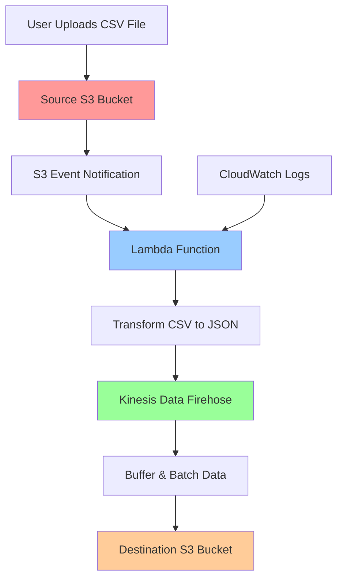

# Project 8: Build a Serverless Data Processing Pipeline with S3, Lambda, and Kinesis Data Firehose

## 1. Objective
In this advanced project, you will build a fully serverless, event-driven data processing pipeline that automatically ingests, transforms, and stores data without managing any servers. The pipeline demonstrates how to create a scalable, cost-effective solution for processing data files as they arrive in S3. You'll learn key concepts including event-driven architecture, serverless ETL processing, and automated data delivery using AWS managed services.

When a CSV file is uploaded to an S3 bucket, it will automatically trigger a Lambda function that transforms the CSV data into JSON format and sends it to a Kinesis Data Firehose stream, which then batches and delivers the processed data to a destination S3 bucket.

## 2. AWS Services Used
- **Amazon S3**: Source and destination storage for raw and processed data
- **AWS Lambda**: Serverless compute for data transformation logic
- **Amazon Kinesis Data Firehose**: Managed data delivery service for batching and streaming to S3
- **AWS IAM**: Identity and access management for secure service-to-service communication
- **Amazon CloudWatch**: Monitoring and logging for the pipeline

## 3. Difficulty
**Advanced**

## 4. Architecture Diagram


**Data Flow:**
1. CSV file uploaded to source S3 bucket
2. S3 triggers Lambda function via event notification
3. Lambda reads CSV, transforms to JSON records
4. Lambda sends JSON records to Kinesis Data Firehose
5. Firehose buffers and batches the data
6. Firehose delivers batched data to destination S3 bucket

## 5. Prerequisites
- Ensure you have completed the initial setup detailed in the main [PREREQUISITES.md](../PREREQUISITES.md) file in the repository root.

## 6. Step-by-Step Guide

### Step 1: Create S3 Buckets

1. **Navigate to S3 Console:**
   - Go to the AWS Management Console
   - Search for "S3" and click on the S3 service

2. **Create Source Bucket:**
   - Click "Create bucket"
   - Bucket name: `yourname-raw-data-bucket-[random-numbers]` (replace with your name and add random numbers for uniqueness)
   - Region: Choose your preferred region (remember this for other resources)
   - Leave all other settings as default
   - Click "Create bucket"

3. **Create Destination Bucket:**
   - Click "Create bucket" again
   - Bucket name: `yourname-processed-data-bucket-[random-numbers]`
   - Use the same region as the source bucket
   - Leave all other settings as default
   - Click "Create bucket"

### Step 2: Create Kinesis Data Firehose Stream

1. **Navigate to Kinesis Data Firehose Console:**
   - Search for "Kinesis Data Firehose" in the AWS Console (not just "Kinesis")
   - Click on "Amazon Kinesis Data Firehose" from the search results
   - **Alternative**: Search for "Kinesis" → Click "Amazon Kinesis" → Click "Kinesis Data Firehose" in the left sidebar

2. **Create Delivery Stream:**
   - Click "Create Firehose stream" (the orange button on the right)
   - This will start the delivery stream creation wizard

3. **Configure Source and Destination:**
   - **Choose source**: Select "Direct PUT" (this means your Lambda function will send data directly)
   - **Choose destination**: Select "Amazon S3"
   - **Firehose stream name**: `data-transformation-stream`

4. **Configure S3 Destination:**
   - **S3 bucket**: Choose your `yourname-processed-data-bucket` from the dropdown
   - **Dynamic partitioning**: Leave disabled for this project
   - **S3 bucket prefix**: `processed-data/year=!{timestamp:yyyy}/month=!{timestamp:MM}/day=!{timestamp:dd}/hour=!{timestamp:HH}/`
   - **S3 bucket error output prefix**: `errors/`

5. **Configure Buffer Settings:**
   - **Buffer size**: 1 MB (minimum for testing)
   - **Buffer interval**: 60 seconds
   - **Compression**: GZIP (optional but recommended)

6. **Configure Permissions (IMPORTANT):**
   - **Service access**: Choose "Create or update IAM role"
   - **IAM role**: The console will suggest a role name like `KinesisFirehoseServiceRole-data-transfor-[region]-[timestamp]`
   - **Allow AWS to create this role** - Make sure this option is selected
   - The role will be automatically created with the necessary permissions to write to your S3 bucket

7. **Advanced Settings (Optional):**
   - **Error record handling**: Leave as default
   - **Logging**: Enable CloudWatch logging (recommended for troubleshooting)

8. **Review and Create:**
   - Review all settings
   - Click "Create Firehose stream"
   - Wait for the stream to become "Active" (this may take a few minutes)

### Step 3: Create IAM Role and Lambda Function

#### Create IAM Role

1. **Navigate to IAM Console:**
   - In the AWS Console search bar, type "IAM" and click on "Identity and Access Management (IAM)"
   - In the left navigation panel, click "Roles"

2. **Create Custom Policy First:**
   - In the left navigation panel, click "Policies"
   - Click the "Create policy" button (blue button on the right)
   - Click the "JSON" tab (not Visual editor)
   - Delete all existing content and paste:
   ```json
   {
       "Version": "2012-10-17",
       "Statement": [
           {
               "Effect": "Allow",
               "Action": [
                   "s3:GetObject"
               ],
               "Resource": "arn:aws:s3:::yourname-raw-data-bucket-*/*"
           },
           {
               "Effect": "Allow",
               "Action": [
                   "firehose:PutRecord",
                   "firehose:PutRecordBatch"
               ],
               "Resource": "*"
           }
       ]
   }
   ```
   - **Important**: Replace `yourname-raw-data-bucket-*` with your actual source bucket name pattern
   - Click "Next" button
   - **Policy name**: Enter `LambdaDataProcessingPolicy`
   - **Description**: "Allows Lambda to read from S3 and write to Kinesis Firehose"
   - Click "Create policy" button

3. **Create the IAM Role:**
   - In the left navigation panel, click "Roles"
   - Click the "Create role" button (blue button on the right)
   - **Trusted entity type**: Select "AWS service" (should be selected by default)
   - **Service or use case**: Scroll down and select "Lambda" from the list
   - Click "Next" button

4. **Attach Permissions Policies:**
   - In the search box, type "AWSLambdaBasicExecutionRole"
   - Check the box next to "AWSLambdaBasicExecutionRole" policy
   - In the search box, clear the previous search and type "LambdaDataProcessingPolicy"
   - Check the box next to "LambdaDataProcessingPolicy" (the custom policy you just created)
   - You should now have both policies selected:
     - ✅ AWSLambdaBasicExecutionRole
     - ✅ LambdaDataProcessingPolicy
   - Click "Next" button

5. **Name and Create the Role:**
   - **Role name**: Enter `LambdaDataProcessingRole`
   - **Description**: "Execution role for CSV to JSON transformer Lambda function"
   - Click "Create role" button

#### Create Lambda Function

1. **Navigate to Lambda Console:**
   - In the AWS Console search bar, type "Lambda" and click on "AWS Lambda"

2. **Create Function:**
   - Click "Create function" button (orange button on the right)
   - Ensure "Author from scratch" is selected (default)
   - **Function name**: `csv-to-json-transformer`
   - **Runtime**: Select "Python 3.12" from the dropdown
   - **Architecture**: Leave as "x86_64" (default)

3. **Configure Execution Role:**
   - Expand "Change default execution role" section
   - Select "Use an existing role"
   - **Existing role**: Choose "LambdaDataProcessingRole" from the dropdown
   - Click "Create function" button

4. **Upload Function Code:**
   - In the "Code source" section, you'll see a code editor with default code
   - Select all the default code (Ctrl+A) and delete it
   - Copy the contents of `transform-lambda.py` from the assets folder and paste it
   - **Important**: Update line 13 with your actual Firehose stream name:
     ```python
     FIREHOSE_STREAM_NAME = 'data-transformation-stream'
     ```
   - Click "Deploy" button (orange button above the code editor)

5. **Configure Function Settings:**
   - Click the "Configuration" tab (next to "Code")
   - In the left sidebar under Configuration, click "General configuration"
   - Click the "Edit" button
   - **Timeout**: Change from 3 seconds to "1 min 0 sec"
   - **Memory**: Leave as 128 MB (sufficient for this project)
   - **Description**: "Transforms CSV files to JSON and sends to Kinesis Firehose"
   - Click "Save" button

### Step 4: Configure S3 Trigger

1. **Navigate to Source S3 Bucket:**
   - Go to S3 console
   - Click on your source bucket (`yourname-raw-data-bucket`)

2. **Configure Event Notification:**
   - Go to "Properties" tab
   - Scroll down to "Event notifications"
   - Click "Create event notification"

3. **Set Event Configuration:**
   - Event name: `csv-file-upload-trigger`
   - Prefix: (leave empty to trigger on all files)
   - Suffix: `.csv`
   - Event types: Check "All object create events" (or specifically "s3:ObjectCreated:Put" and "s3:ObjectCreated:Post")

4. **Set Destination:**
   - Destination type: "Lambda function"
   - Lambda function: Select `csv-to-json-transformer`
   - Click "Save changes"

### Step 5: Test the Full Pipeline

1. **Upload Test File:**
   - Navigate to your source S3 bucket
   - Click "Upload"
   - Select the `sample-data.csv` file from the assets folder
   - Click "Upload"

2. **Monitor Lambda Execution:**
   - Go to Lambda console → Functions → `csv-to-json-transformer`
   - Click on "Monitor" tab
   - Click "View CloudWatch logs"
   - Look for the latest log stream to see execution details

3. **Verify Data in Destination Bucket:**
   - Wait 1-2 minutes for Firehose buffering
   - Navigate to your destination S3 bucket
   - Look for a folder structure like `processed-data/year=2025/month=09/day=10/hour=XX/`
   - Download and examine the processed file (should be in JSON format)

## 7. Troubleshooting Common Issues

### Problem 0: Firehose creation fails with "unable to assume role" error

**Error Message**: "Firehose is unable to assume role arn:aws:iam::XXXX:role/service-role/KinesisFirehoseServiceRole-... Please check the role provided."

**Potential Causes:**
- IAM role creation failed or was not properly configured during Firehose setup
- Insufficient permissions to create IAM roles
- Role exists but has incorrect trust policy or permissions

**Solutions:**
1. **Use Automatic Role Creation (Recommended):**
   - During Firehose creation, select "Create or update IAM role"
   - Let AWS automatically create the role with correct permissions
   - Ensure your AWS user has IAM permissions to create roles

2. **Manual Role Creation (If automatic fails):**
   - Go to IAM Console → Roles → Create role
   - Trusted entity: "AWS service" → "Kinesis Data Firehose"
   - Attach policy: Search for and attach "AmazonKinesisFirehoseDeliveryRolePolicy"
   - Role name: `KinesisFirehoseDeliveryRole`
   - Use this role when creating the Firehose stream

3. **Check Your IAM Permissions:**
   - Ensure your AWS user has permissions to create IAM roles
   - Required permissions: `iam:CreateRole`, `iam:AttachRolePolicy`, `iam:PassRole`

### Problem 1: Uploading the CSV file to S3 does not trigger the Lambda function

**Potential Causes:**
- S3 event notification is misconfigured (wrong event type, incorrect suffix filter)
- Permissions between S3 and Lambda were not set up correctly
- Lambda function is in a different region than the S3 bucket

**Solutions:**
1. **Verify Event Notification Configuration:**
   - Go to S3 bucket → Properties → Event notifications
   - Ensure the event notification exists and shows "Enabled"
   - Check that the suffix is exactly `.csv` (case-sensitive)
   - Verify event types include object creation events

2. **Check Lambda Function Permissions:**
   - Go to Lambda function → Configuration → Permissions
   - Look for a resource-based policy that allows S3 to invoke the function
   - If missing, delete and recreate the S3 event notification

3. **Verify Regional Consistency:**
   - Ensure S3 bucket and Lambda function are in the same AWS region

### Problem 2: The Lambda function is triggered but fails with an error

**Potential Causes:**
- Lambda's IAM execution role lacks required permissions
- Incorrect Firehose stream name in the Lambda code
- CSV file format issues or empty file

**Solutions:**
1. **Check CloudWatch Logs (FIRST STEP):**
   - Lambda console → Monitor → View CloudWatch logs
   - Look for error messages like "AccessDenied", "ResourceNotFound", or Python exceptions

2. **Verify IAM Role Permissions:**
   - IAM console → Roles → LambdaDataProcessingRole
   - Check attached policies include:
     - `AWSLambdaBasicExecutionRole`
     - Custom policy with `s3:GetObject` and `firehose:PutRecord` permissions
   - Ensure S3 resource ARN matches your bucket name exactly

3. **Validate Configuration:**
   - Check that `FIREHOSE_STREAM_NAME` in Lambda code matches your actual stream name
   - Verify the CSV file has content and proper formatting

### Problem 3: The Lambda function executes successfully, but no data appears in the destination S3 bucket

**Potential Causes:**
- Kinesis Data Firehose buffering behavior (normal operation)
- Firehose delivery stream configuration issues
- Small data size not meeting buffer thresholds

**Solutions:**
1. **Understand Firehose Buffering:**
   - Firehose batches data based on buffer size (1 MB) OR time interval (60 seconds)
   - For small test files, you'll need to wait for the time interval
   - This is normal and expected behavior

2. **Force Data Delivery (for testing):**
   - Kinesis console → Data Firehose → your stream → Monitoring
   - Wait for the full buffer interval (60 seconds)
   - Or upload multiple CSV files to reach the buffer size threshold

3. **Check Firehose Configuration:**
   - Verify destination S3 bucket is correct
   - Check error records in the S3 error prefix path
   - Review Firehose monitoring metrics for delivery failures

### Problem 4: Data appears in destination bucket but format is incorrect

**Potential Causes:**
- Lambda transformation logic errors
- Character encoding issues
- Malformed JSON output

**Solutions:**
1. **Review Lambda Logs:**
   - Check CloudWatch logs for any transformation warnings or errors
   - Verify that JSON serialization is working correctly

2. **Test with Different Data:**
   - Try uploading a simpler CSV file with basic ASCII characters
   - Check if special characters or encoding cause issues

3. **Validate JSON Output:**
   - Download the output file from destination bucket
   - Use a JSON validator to check format correctness

## 8. Learning Materials & Key Concepts

### Concept 1: Event-Driven Architecture
Event-driven architecture is a software design pattern where services communicate through events rather than direct calls. In this project:
- **Loose Coupling**: S3, Lambda, and Firehose don't need to know about each other's internal workings
- **Scalability**: Each service can scale independently based on demand
- **Resilience**: If one service fails, others continue operating
- **Asynchronous Processing**: Services react to events when they occur, enabling real-time data processing

**Contrast with Traditional Architecture:**
- Monolithic: All processing in one application
- Synchronous: Components wait for responses before proceeding
- Tight Coupling: Components directly depend on each other

### Concept 2: S3 Event Notifications
S3 Event Notifications turn Amazon S3 into a powerful event source for serverless architectures:
- **Event Types**: Object creation, deletion, restoration, replication
- **Destinations**: Lambda, SQS, SNS for different processing patterns
- **Filtering**: Prefix and suffix filters to trigger only on specific files
- **Use Cases**: Data pipelines, backup automation, content processing, real-time analytics

**SAA-C03 Exam Relevance:**
- Know when to use S3 events vs. S3 Transfer Acceleration
- Understand event notification reliability and ordering
- Recognize patterns for multi-step data processing workflows

### Concept 3: AWS Lambda for ETL
Lambda excels at Extract, Transform, Load (ETL) operations for several reasons:
- **Serverless**: No infrastructure management, automatic scaling
- **Event-Driven**: Perfect for processing data as it arrives
- **Cost-Effective**: Pay only for compute time used
- **Language Support**: Python, Node.js, Java, Go, .NET, Ruby

**ETL Patterns with Lambda:**
- **File Processing**: Transform data formats (CSV to JSON, XML to Parquet)
- **Data Enrichment**: Add metadata, lookup values, calculate fields
- **Data Validation**: Check data quality and format compliance
- **Data Routing**: Send data to different destinations based on content

**Limitations to Consider:**
- 15-minute maximum execution time
- Memory limits (128 MB to 10,240 MB)
- Temporary storage (/tmp) limited to 10 GB
- For large-scale ETL, consider AWS Glue or EMR

### Concept 4: Amazon Kinesis Data Firehose
Kinesis Data Firehose is a fully managed service for data ingestion and delivery:

**Key Features:**
- **Automatic Scaling**: Handles any data volume without configuration
- **Buffering**: Batches data for efficient delivery (size and time-based)
- **Compression**: Reduces storage costs (GZIP, ZIP, Snappy)
- **Transformation**: Optional data transformation with Lambda
- **Destinations**: S3, Redshift, Elasticsearch, Splunk, HTTP endpoints

**Firehose vs. Kinesis Data Streams:**
- **Firehose**: Delivery-focused, managed consumers, near real-time (60 seconds+)
- **Data Streams**: Processing-focused, custom consumers, real-time (milliseconds)

**Buffering Configuration:**
- **Buffer Size**: 1-128 MB (triggers delivery when reached)
- **Buffer Interval**: 60-900 seconds (triggers delivery when elapsed)
- **Delivery**: Whichever condition is met first triggers delivery

**SAA-C03 Exam Tips:**
- Know when to choose Firehose vs. Data Streams vs. Kinesis Analytics
- Understand buffering impact on near real-time requirements
- Recognize cost optimization patterns with compression and buffering

## 9. Cost & Free Tier Eligibility

This project is designed to minimize costs and leverage AWS Free Tier benefits:

### AWS Lambda
- **Free Tier**: 1 million free requests per month + 400,000 GB-seconds of compute time
- **Project Usage**: 1-2 function invocations for testing
- **Estimated Cost**: $0.00 (well within free tier)

### Amazon S3
- **Free Tier**: 5 GB storage + 20,000 GET requests + 2,000 PUT requests
- **Project Usage**: Small CSV and JSON files (< 1 MB total)
- **Estimated Cost**: $0.00 (within free tier)

### Amazon Kinesis Data Firehose
- **Free Tier**: None available
- **Pricing**: $0.029 per GB ingested (first 500 TB/month)
- **Project Usage**: < 1 MB of data
- **Estimated Cost**: < $0.01

### Amazon CloudWatch
- **Free Tier**: 10 custom metrics + 5 GB log ingestion + 1 million API requests
- **Project Usage**: Basic Lambda logging
- **Estimated Cost**: $0.00 (within free tier)

**Total Estimated Cost**: < $0.01 for the entire project

## 10. Cleanup Instructions

Follow these steps in order to avoid dependency issues:

### Step 1: Empty S3 Buckets
1. **Empty Source Bucket:**
   - Navigate to S3 console
   - Select your source bucket (`yourname-raw-data-bucket`)
   - Click "Empty"
   - Type "permanently delete" to confirm
   - Click "Empty"

2. **Empty Destination Bucket:**
   - Select your destination bucket (`yourname-processed-data-bucket`)
   - Click "Empty"
   - Type "permanently delete" to confirm
   - Click "Empty"

### Step 2: Delete S3 Buckets
1. **Delete Source Bucket:**
   - Select the empty source bucket
   - Click "Delete"
   - Type the bucket name to confirm
   - Click "Delete bucket"

2. **Delete Destination Bucket:**
   - Select the empty destination bucket
   - Click "Delete"
   - Type the bucket name to confirm
   - Click "Delete bucket"

### Step 3: Delete Kinesis Data Firehose Stream
1. **Navigate to Kinesis Console:**
   - Go to Kinesis service
   - Click "Data Firehose"

2. **Delete Delivery Stream:**
   - Select `data-transformation-stream`
   - Click "Delete"
   - Type "delete" to confirm
   - Click "Delete"

### Step 4: Delete Lambda Function
1. **Navigate to Lambda Console:**
   - Go to Lambda service
   - Select `csv-to-json-transformer`

2. **Delete Function:**
   - Click "Actions" → "Delete function"
   - Type "delete" to confirm
   - Click "Delete"

### Step 5: Delete IAM Role
1. **Navigate to IAM Console:**
   - Go to IAM service
   - Click "Roles"

2. **Delete Custom Policy First:**
   - Click "Policies"
   - Search for "LambdaDataProcessingPolicy"
   - Select the policy and click "Delete"
   - Type the policy name to confirm

3. **Delete Role:**
   - Click "Roles"
   - Search for "LambdaDataProcessingRole"
   - Select the role and click "Delete"
   - Type the role name to confirm

### Step 6: Delete CloudWatch Log Group
1. **Navigate to CloudWatch Console:**
   - Go to CloudWatch service
   - Click "Log groups" in the left sidebar

2. **Delete Lambda Log Group:**
   - Find `/aws/lambda/csv-to-json-transformer`
   - Select the log group
   - Click "Actions" → "Delete log group(s)"
   - Click "Delete" to confirm

## 11. Associated Project Files

The following files are available in the `assets` folder:

### `transform-lambda.py`
**Purpose**: Complete Python Lambda function code for transforming CSV data to JSON and sending to Kinesis Data Firehose.

**Key Features**:
- Reads CSV files from S3 using boto3
- Converts each CSV row to JSON format
- Sends transformed records to Kinesis Data Firehose
- Includes comprehensive error handling and logging
- Configurable Firehose stream name

### `sample-data.csv`
**Purpose**: Test data file with product information to validate the complete data pipeline.

**Contents**:
- Header row with column names (ProductId, ProductName, Category, Price)
- 3 sample product records for testing
- Properly formatted CSV structure for reliable parsing

**Usage**: Upload this file to your source S3 bucket to trigger the Lambda function and test the end-to-end pipeline.

---

## Next Steps
After completing this project, consider these enhancements:
1. Add data validation and error handling in the Lambda function
2. Implement data partitioning strategies for better S3 organization
3. Add monitoring and alerting using CloudWatch alarms
4. Explore Lambda layers for shared code and dependencies
5. Implement data transformation using AWS Glue for larger datasets

This project provides a solid foundation for building production-ready serverless data pipelines on AWS.
