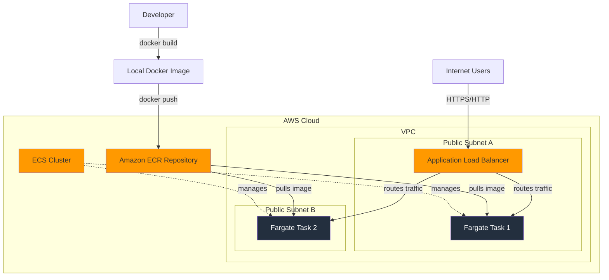

# Project 9: Deploy a Containerized Web Application with Amazon ECS and AWS Fargate

## 1. Objective

In this advanced project, you will learn how to containerize a web application and deploy it on AWS's serverless container platform. You will package a Python Flask web application into a Docker container, store it in Amazon's container registry (ECR), and run it using Amazon ECS with AWS Fargate. This project introduces you to modern cloud-native application deployment patterns and key containerization concepts that are essential for the AWS Solutions Architect Associate exam.

By the end of this project, you will understand how to:
- Build and test Docker containers locally
- Push container images to Amazon ECR
- Deploy containerized applications using ECS and Fargate
- Configure load balancing for containerized applications
- Troubleshoot common container deployment issues

## 2. AWS Services Used

- **Amazon ECS (Elastic Container Service):** Container orchestration service
- **AWS Fargate:** Serverless compute engine for containers
- **Amazon ECR (Elastic Container Registry):** Managed Docker container registry
- **Application Load Balancer (ALB):** Layer 7 load balancer for HTTP/HTTPS traffic
- **IAM (Identity and Access Management):** For service permissions
- **VPC (Virtual Private Cloud):** Network infrastructure
- **CloudWatch:** For logging and monitoring

## 3. Difficulty

Advanced

## 4. Architecture Diagram



## 5. Prerequisites

- Ensure you have completed the initial setup detailed in the main [PREREQUISITES.md](../PREREQUISITES.md) file in the repository root.
- **Docker Desktop:** You must have Docker Desktop installed and running on your local machine to build the container image. Download from [docker.com](https://www.docker.com/products/docker-desktop/)
- **AWS CLI v2:** Must be configured with appropriate permissions
- **Basic understanding of containers:** While this guide explains concepts, familiarity with Docker basics is helpful

## 6. Step-by-Step Guide

### Step 1: Build and Test the Docker Image Locally

1. **Navigate to the application directory:**
   ```bash
   cd assets/app
   ```

2. **Build the Docker image:**
   ```bash
   docker build -t flask-fargate-app .
   ```
   
   This command:
   - Uses the Dockerfile in the current directory
   - Tags the image as "flask-fargate-app"
   - Creates a multi-stage build for optimal image size

3. **Run the container locally to test:**
   ```bash
   docker run -p 8080:8080 flask-fargate-app
   ```

4. **Test the application:**
   - Open your web browser and navigate to `http://localhost:8080`
   - You should see the "Hello from Fargate!" message
   - Test the health endpoint at `http://localhost:8080/health`

5. **Stop the container:**
   - Press `Ctrl+C` in the terminal where the container is running

### Step 2: Create an ECR Repository

1. **Open the Amazon ECR console:**
   - Navigate to the AWS Management Console
   - Search for "ECR" and select "Elastic Container Registry"

2. **Create a new repository:**
   - Click "Create repository"
   - Choose "Private" repository
   - Repository name: `flask-fargate-app`
   - Leave other settings as default
   - Click "Create repository"

3. **Note the repository URI:**
   - After creation, you'll see a URI like: `123456789012.dkr.ecr.us-east-1.amazonaws.com/flask-fargate-app`
   - Copy this URI - you'll need it later

### Step 3: Push the Docker Image to ECR

1. **Get login credentials for ECR:**
   - In the ECR console, select your repository
   - Click "View push commands"
   - Copy and run the first command (authentication):

   **For Windows (Command Prompt):**
   ```cmd
   aws ecr get-login-password --region us-east-1 | docker login --username AWS --password-stdin 123456789012.dkr.ecr.us-east-1.amazonaws.com
   ```

   **For Linux/macOS:**
   ```bash
   aws ecr get-login-password --region us-east-1 | docker login --username AWS --password-stdin 123456789012.dkr.ecr.us-east-1.amazonaws.com
   ```

2. **Tag your local image:**
   ```bash
   docker tag flask-fargate-app:latest 123456789012.dkr.ecr.us-east-1.amazonaws.com/flask-fargate-app:latest
   ```
   
   Replace the URI with your actual ECR repository URI.

3. **Push the image to ECR:**
   ```bash
   docker push 123456789012.dkr.ecr.us-east-1.amazonaws.com/flask-fargate-app:latest
   ```

4. **Verify the push:**
   - Refresh the ECR console
   - You should see your image listed with the "latest" tag

### Step 4: Set Up the ECS Cluster

1. **Open the Amazon ECS console:**
   - Navigate to the AWS Management Console
   - Search for "ECS" and select "Elastic Container Service"

2. **Create a new cluster:**
   - Click "Create Cluster"
   - Choose "Networking only" (Powered by AWS Fargate)
   - Cluster name: `flask-fargate-cluster`
   - Leave VPC settings as default (uses default VPC)
   - Click "Create"

### Step 5: Create an ECS Task Definition

1. **Navigate to Task Definitions:**
   - In the ECS console, click "Task Definitions" in the left sidebar
   - Click "Create new Task Definition"

2. **Select launch type:**
   - Choose "Fargate"
   - Click "Next step"

3. **Configure Task Definition:**
   - **Task Definition Name:** `flask-fargate-task`
   - **Task Role:** Leave empty (not needed for this basic app)
   - **Task execution IAM role:** Select "ecsTaskExecutionRole" (if it doesn't exist, ECS will create it)

4. **Configure Task size:**
   - **Task memory (GB):** 0.5 GB (512 MB)
   - **Task CPU (vCPU):** 0.25 vCPU (256 CPU units)

5. **Add Container:**
   - Click "Add container"
   - **Container name:** `flask-app`
   - **Image:** Your ECR URI (e.g., `123456789012.dkr.ecr.us-east-1.amazonaws.com/flask-fargate-app:latest`)
   - **Memory Limits:** Soft limit: 512 MB
   - **Port mappings:** 
     - Container port: 8080
     - Protocol: tcp
   - Leave other settings as default
   - Click "Add"

6. **Create the Task Definition:**
   - Click "Create"

### Step 6: Create an ECS Service

1. **Navigate to your cluster:**
   - Go back to the ECS console
   - Click on your cluster (`flask-fargate-cluster`)

2. **Create a new service:**
   - Click the "Services" tab
   - Click "Create"

3. **Configure Service:**
   - **Launch type:** Fargate
   - **Task Definition:** Select `flask-fargate-task:1` (latest revision)
   - **Service name:** `flask-fargate-service`
   - **Number of tasks:** 2 (for high availability)
   - **Minimum healthy percent:** 50
   - **Maximum percent:** 200

4. **Configure Network:**
   - **Cluster VPC:** Select the default VPC
   - **Subnets:** Select at least 2 public subnets in different AZs
   - **Security groups:** Create a new security group
     - **Security group name:** `flask-fargate-sg`
     - **Description:** Security group for Flask Fargate service
     - **Inbound rules:** 
       - Type: Custom TCP
       - Port: 8080
       - Source: Anywhere (0.0.0.0/0) - for ALB access
   - **Auto-assign public IP:** ENABLED

5. **Configure Load Balancing:**
   - **Load balancer type:** Application Load Balancer
   - **Load balancer name:** `flask-fargate-alb`
   - **Listener port:** 80
   - **Target group name:** `flask-fargate-targets`
   - **Target group protocol:** HTTP
   - **Target group port:** 8080
   - **Health check path:** `/health`

6. **Configure Auto Scaling (optional):**
   - You can leave this disabled for this tutorial
   - Click "Next step"

7. **Review and Create:**
   - Review all settings
   - Click "Create Service"

### Step 7: Verify the Deployment

1. **Wait for service deployment:**
   - The service creation will take 5-10 minutes
   - Monitor the "Events" tab for progress
   - Wait until the service shows "2 running tasks"

2. **Find the Load Balancer DNS name:**
   - Go to the EC2 console
   - Click "Load Balancers" in the left sidebar
   - Find your ALB (`flask-fargate-alb`)
   - Copy the "DNS name" from the details panel

3. **Test the application:**
   - Open a web browser
   - Navigate to the ALB DNS name (e.g., `flask-fargate-alb-123456789.us-east-1.elb.amazonaws.com`)
   - You should see the "Hello from Fargate!" message
   - The ALB will distribute requests between your 2 Fargate tasks

## 7. Troubleshooting Common Issues

### Problem 1: Docker push command to ECR fails with "no basic auth credentials"

**Potential Causes:**
- The AWS CLI to Docker login command was not run
- The login token expired (ECR tokens are valid for 12 hours)
- Insufficient IAM permissions for ECR operations

**Solutions:**
1. **Re-run the login command:**
   ```bash
   aws ecr get-login-password --region us-east-1 | docker login --username AWS --password-stdin 123456789012.dkr.ecr.us-east-1.amazonaws.com
   ```

2. **Verify IAM permissions:** Ensure your user/role has these ECR permissions:
   - `ecr:GetAuthorizationToken`
   - `ecr:BatchCheckLayerAvailability`
   - `ecr:GetDownloadUrlForLayer`
   - `ecr:BatchGetImage`
   - `ecr:InitiateLayerUpload`
   - `ecr:UploadLayerPart`
   - `ecr:CompleteLayerUpload`
   - `ecr:PutImage`

### Problem 2: ECS Task fails to start (repeatedly stopping and starting)

**Potential Causes:**
1. **Networking:** Fargate task cannot pull the image from ECR
2. **Permissions:** ECS Task Execution Role missing ECR permissions
3. **Application crash:** Container starts but application fails immediately

**Solutions:**
1. **Check Task Execution Role:** Ensure the `ecsTaskExecutionRole` has the `AmazonECSTaskExecutionRolePolicy` attached

2. **Verify network configuration:** Ensure tasks are in public subnets with "Auto-assign public IP" enabled

3. **Check CloudWatch logs:**
   - Go to CloudWatch console
   - Navigate to Log Groups
   - Find the log group for your task (usually `/ecs/flask-fargate-task`)
   - Check for application errors

4. **Review task stopped reason:**
   - In ECS console, click on the stopped task
   - Check the "Stopped reason" field for specific error messages

### Problem 3: Task is RUNNING but ALB reports target as "unhealthy"

**Potential Causes:**
- Security group not allowing traffic from ALB to container port 8080
- ALB health check configuration incorrect
- Application not responding on the health check path

**Solutions:**
1. **Verify Security Group rules:**
   - **ECS Service Security Group:** Must allow inbound TCP 8080 from ALB security group
   - **ALB Security Group:** Must allow inbound HTTP (80) from internet (0.0.0.0/0)

2. **Check ALB Target Group health:**
   - Go to EC2 console → Target Groups
   - Select your target group
   - Check the "Health checks" tab
   - Verify health check path is `/health`
   - Check if targets are showing as "healthy"

3. **Test health check endpoint:**
   - If you can access the main application but health checks fail
   - Verify the `/health` endpoint returns a 200 status code

### Problem 4: "Task stopped with exit code 125 or 127"

**Potential Causes:**
- Docker image built for wrong architecture (ARM vs x86)
- Missing dependencies in the container
- Incorrect CMD or ENTRYPOINT in Dockerfile

**Solutions:**
1. **Rebuild for correct architecture:**
   ```bash
   docker build --platform linux/amd64 -t flask-fargate-app .
   ```

2. **Test image locally first:**
   ```bash
   docker run -p 8080:8080 flask-fargate-app
   ```

3. **Check container logs in CloudWatch for specific error messages**

## 8. Learning Materials & Key Concepts

### Concept 1: Containers vs. Virtual Machines

**Containers** virtualize the operating system, sharing the host OS kernel while isolating the application and its dependencies. This makes them:
- **Lightweight:** Start in seconds, minimal resource overhead
- **Portable:** Run consistently across different environments
- **Scalable:** Easy to scale horizontally

**Virtual Machines** virtualize the entire hardware stack, including the operating system:
- **Heavier:** Require more resources and time to start
- **Isolated:** Complete OS isolation but with higher overhead
- **Use case:** Better for workloads requiring different operating systems

### Concept 2: Key Container Components

- **Dockerfile:** A text file containing instructions to build a container image (the "recipe")
- **Image:** A read-only template used to create containers (the "blueprint" or "class")
- **Container:** A running instance of an image (the "object" or "process")
- **Registry:** A service for storing and distributing container images (like ECR or Docker Hub)

### Concept 3: ECS Launch Types - Fargate vs. EC2

**AWS Fargate (Serverless):**
- ✅ **Pros:** No server management, automatic scaling, pay-per-use
- ❌ **Cons:** Less control, potentially higher cost for sustained workloads
- **Use case:** Microservices, variable workloads, when you want to focus on application development

**EC2 Launch Type:**
- ✅ **Pros:** More control, potentially lower cost for sustained workloads, access to underlying EC2 features
- ❌ **Cons:** Must manage EC2 instances, patching, scaling
- **Use case:** Large-scale applications, specific instance requirements, cost optimization for steady workloads

### Concept 4: Core ECS Components

- **Cluster:** A logical grouping of compute resources (like a "data center")
- **Task Definition:** A blueprint that describes how containers should run (like a "deployment template")
- **Task:** A running instance of a Task Definition (like a "pod" in Kubernetes)
- **Service:** Maintains a specified number of tasks, handles load balancing and auto-scaling (like a "deployment controller")

### Key SAA-C03 Exam Topics:
1. **Container orchestration patterns**
2. **Fargate vs. EC2 launch types**
3. **ECS service discovery and load balancing**
4. **Container security best practices**
5. **Cost optimization strategies for containerized workloads**

## 9. Cost & Free Tier Eligibility

### AWS Fargate
- **Free Tier:** 750 hours per month of Fargate with 0.25 vCPU and 0.5 GB memory
- **Pricing:** Billed per vCPU and memory consumed per second
- **This project:** Uses 0.25 vCPU and 0.5 GB memory × 2 tasks = within free tier limits

### Amazon ECR
- **Free Tier:** 500 MB of storage per month
- **Pricing:** $0.10 per GB per month for storage, data transfer charges apply
- **This project:** Docker image (~200 MB) is well within free tier

### Application Load Balancer
- **No Free Tier:** Primary cost driver for small projects
- **Pricing:** ~$16-25 per month for basic usage (fixed cost + LCU charges)
- **Cost optimization:** Use Network Load Balancer for simple TCP traffic (cheaper)

### Estimated Monthly Cost (beyond free tier):
- **ALB:** $20-25/month
- **ECR:** $0.02/month (200 MB image)
- **Fargate:** $0/month (within free tier)
- **Total:** ~$20-25/month

## 10. Cleanup Instructions

**Important:** Follow this order to avoid dependency errors:

### Step 1: Delete ECS Service
1. Go to ECS console → Clusters → flask-fargate-cluster
2. Click on the "Services" tab
3. Select `flask-fargate-service`
4. Click "Update"
5. Set "Number of tasks" to 0
6. Click "Update Service"
7. Wait for all tasks to stop
8. Click "Delete" and confirm

### Step 2: Delete ECS Cluster
1. In ECS console, select your cluster
2. Click "Delete Cluster"
3. Type the cluster name to confirm
4. Click "Delete"

### Step 3: Delete Application Load Balancer
1. Go to EC2 console → Load Balancers
2. Select `flask-fargate-alb`
3. Actions → Delete
4. Type "delete" to confirm

### Step 4: Delete Target Group
1. Go to EC2 console → Target Groups
2. Select `flask-fargate-targets`
3. Actions → Delete
4. Confirm deletion

### Step 5: Delete Security Groups
1. Go to EC2 console → Security Groups
2. Select `flask-fargate-sg`
3. Actions → Delete security groups
4. Confirm deletion

### Step 6: Deregister Task Definition
1. Go to ECS console → Task Definitions
2. Select `flask-fargate-task`
3. Select revision 1
4. Actions → Deregister
5. Confirm

### Step 7: Delete ECR Repository
1. Go to ECR console
2. Select `flask-fargate-app` repository
3. Delete all images first:
   - Select all images
   - Delete
4. Then delete the repository:
   - Actions → Delete
   - Type "delete" to confirm

### Step 8: Delete CloudWatch Log Group
1. Go to CloudWatch console → Log groups
2. Find `/ecs/flask-fargate-task`
3. Select and delete the log group

## 11. Associated Project Files

The following files are located in the `assets/app` directory:

- **`main.py`:** A Python Flask web application that serves a greeting message on port 8080. Includes both a main route (/) and a health check endpoint (/health) for ALB health monitoring.

- **`requirements.txt`:** Python dependencies file specifying Flask, Werkzeug, and Gunicorn versions. These are the minimal packages needed to run the Flask application in production.

- **`Dockerfile`:** A multi-stage Dockerfile that creates a lightweight, secure container image. Uses Python 3.11-slim as base, creates a non-root user for security, and configures Gunicorn as the production WSGI server. Includes health checks and proper layer caching for optimal build performance.

Each file includes comprehensive comments explaining their purpose and best practices for containerized applications on AWS.
