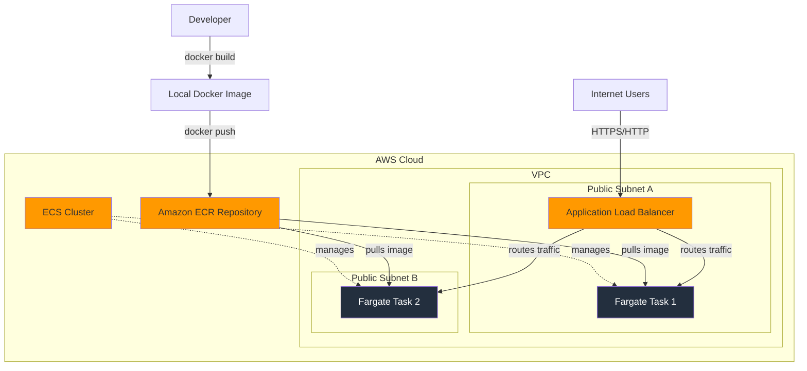

# Project 9: Deploy a Containerized Web Application with Amazon ECS and AWS Fargate

## 1. Objective

In this advanced project, you will learn how to containerize a web application and deploy it on AWS's serverless container platform. You will package a Python Flask web application into a Docker container, store it in Amazon's container registry (ECR), and run it using Amazon ECS with AWS Fargate. This project introduces you to modern cloud-native application deployment patterns and key containerization concepts that are essential for the AWS Solutions Architect Associate exam.

By the end of this project, you will understand how to:
- Build and test Docker containers locally
- Push container images to Amazon ECR
- Deploy containerized applications using ECS and Fargate
- Configure load balancing for containerized applications
- Troubleshoot common container deployment issues

## 2. AWS Services Used

- **Amazon ECS (Elastic Container Service):** Container orchestration service
- **AWS Fargate:** Serverless compute engine for containers
- **Amazon ECR (Elastic Container Registry):** Managed Docker container registry
- **Application Load Balancer (ALB):** Layer 7 load balancer for HTTP/HTTPS traffic
- **IAM (Identity and Access Management):** For service permissions
- **VPC (Virtual Private Cloud):** Network infrastructure
- **CloudWatch:** For logging and monitoring

## 3. Difficulty

Advanced

## 4. Architecture Diagram



## 5. Prerequisites

- Ensure you have completed the initial setup detailed in the main [PREREQUISITES.md](../PREREQUISITES.md) file in the repository root.
- **Docker Desktop:** You must have Docker Desktop installed and running on your local machine to build the container image. Download from [docker.com](https://www.docker.com/products/docker-desktop/)
- **AWS CLI v2:** Must be configured with appropriate permissions
- **Basic understanding of containers:** While this guide explains concepts, familiarity with Docker basics is helpful

## 6. Step-by-Step Guide

### Step 1: Build and Test the Docker Image Locally

1. **Navigate to the application directory:**
   ```bash
   cd assets/app
   ```

2. **Build the Docker image:**
   ```bash
   docker build -t flask-fargate-app .
   ```
   
   This command:
   - Uses the Dockerfile in the current directory
   - Tags the image as "flask-fargate-app"
   - Creates a multi-stage build for optimal image size

3. **Run the container locally to test:**
   ```bash
   docker run -p 8080:8080 flask-fargate-app
   ```

4. **Test the application:**
   - Open your web browser and navigate to `http://localhost:8080`
   - You should see the "Hello from Fargate!" message
   - Test the health endpoint at `http://localhost:8080/health`

5. **Stop the container:**
   - Press `Ctrl+C` in the terminal where the container is running

### Step 2: Create an ECR Repository

1. **Open the Amazon ECR console:**
   - Navigate to the AWS Management Console
   - Search for "ECR" in the services search bar
   - Select "Elastic Container Registry" from the results

2. **Create a new repository:**
   - Click the orange "Create repository" button
   - **Visibility settings:** Select "Private" (default)
   - **Repository name:** `flask-fargate-app`
   - **Tag immutability:** Leave as "Disabled" (default)
   - **Image scan settings:** Leave "Scan on push" unchecked for this tutorial
   - **Encryption settings:** Leave as "AES-256" (default)
   - Click "Create repository"

3. **Note the repository URI:**
   - After creation, you'll be redirected to the repository details page
   - Copy the URI displayed at the top (format: `123456789012.dkr.ecr.us-east-1.amazonaws.com/flask-fargate-app`)
   - This URI will be needed for pushing your image

### Step 3: Push the Docker Image to ECR

1. **Get login credentials for ECR:**
   - In the ECR console, select your `flask-fargate-app` repository
   - Click the "View push commands" button in the top-right
   - A modal will appear with platform-specific commands
   - Copy and run the first command (authentication):

   **For Windows (Command Prompt or PowerShell):**
   ```cmd
   aws ecr get-login-password --region us-east-1 | docker login --username AWS --password-stdin 123456789012.dkr.ecr.us-east-1.amazonaws.com
   ```

   **For Linux/macOS/WSL:**
   ```bash
   aws ecr get-login-password --region us-east-1 | docker login --username AWS --password-stdin 123456789012.dkr.ecr.us-east-1.amazonaws.com
   ```

2. **Tag your local image:**
   Use the exact command from the "View push commands" modal:
   ```bash
   docker tag flask-fargate-app:latest 123456789012.dkr.ecr.us-east-1.amazonaws.com/flask-fargate-app:latest
   ```
   
   Replace the URI with your actual ECR repository URI from the modal.

3. **Push the image to ECR:**
   Use the exact command from the "View push commands" modal:
   ```bash
   docker push 123456789012.dkr.ecr.us-east-1.amazonaws.com/flask-fargate-app:latest
   ```

4. **Verify the push:**
   - Close the push commands modal
   - Refresh the repository page
   - You should see your image listed with the "latest" tag and upload timestamp

### Step 4: Set Up the ECS Cluster

1. **Open the Amazon ECS console:**
   - Navigate to the AWS Management Console
   - Search for "ECS" in the services search bar
   - Select "Elastic Container Service" from the results

2. **Create a new cluster:**
   - Click "Create cluster" (orange button)
   - **Cluster configuration:**
     - **Cluster name:** `flask-fargate-cluster`
     - **Namespace:** Leave default or create new (optional)
   - **Infrastructure:**
     - Select "AWS Fargate (serverless)" 
     - Do not select "Amazon EC2 instances"
   - **Monitoring:**
     - Leave "Use Container Insights" unchecked for this tutorial
   - **Tags:** (optional) Add any tags you prefer
   - Click "Create"

3. **Wait for cluster creation:**
   - The cluster will be created within 30-60 seconds
   - You'll see a success message with a "View cluster" button

### Step 5: Create an ECS Task Definition

1. **Navigate to Task Definitions:**
   - In the ECS console, click "Task definitions" in the left navigation menu
   - Click "Create new task definition" (orange button)

2. **Configure Task Definition basics:**
   - **Task definition configuration:**
     - **Task definition family:** `flask-fargate-task`
     - **Launch type:** Select "AWS Fargate"
   - **Operating system/Architecture:** Linux/X86_64
   - **Task size:**
     - **CPU:** 0.25 vCPU
     - **Memory:** 0.5 GB
   - **Task role:** Leave blank (not needed for this basic app)
   - **Task execution role:** Select "ecsTaskExecutionRole" (will auto-create if missing)

3. **Configure Container:**
   - In the "Container definitions" section, click "Add container"
   - **Essential container details:**
     - **Container name:** `flask-app`
     - **Image URI:** Your full ECR URI (e.g., `123456789012.dkr.ecr.us-east-1.amazonaws.com/flask-fargate-app:latest`)
   - **Resource allocation limits:**
     - **Memory limit:** 512 (MiB) - Soft limit
   - **Port mappings:**
     - **Container port:** 8080
     - **Protocol:** TCP
     - **Port name:** `flask-app-8080-tcp` (auto-generated)
     - **App protocol:** HTTP
   - **Environment variables:** Leave empty for this tutorial
   - **HealthCheck:** Leave as default (Docker HEALTHCHECK will be used)

4. **Configure Logging (optional but recommended):**
   - **Log configuration:**
     - **Log driver:** awslogs
     - **Log group:** `/ecs/flask-fargate-task` (will auto-create)
     - **AWS Region:** us-east-1
     - **Stream prefix:** ecs

5. **Create the Task Definition:**
   - Click "Create" at the bottom of the page
   - Wait for the success message

### Step 6: Create an ECS Service

1. **Navigate to your cluster:**
   - Return to the ECS console main page
   - Click on your cluster name (`flask-fargate-cluster`)

2. **Create a new service:**
   - In the cluster details page, go to the "Services" tab
   - Click "Create" (orange button)

3. **Environment configuration:**
   - **Compute options:** 
     - Select "Launch type"
     - **Launch type:** Fargate
   - **Platform version:** LATEST

4. **Deployment configuration:**
   - **Application type:** Service
   - **Task definition:**
     - **Family:** `flask-fargate-task`
     - **Revision:** LATEST (or select the specific revision)
   - **Service name:** `flask-fargate-service`
   - **Desired tasks:** 2

5. **Networking configuration:**
   - **VPC:** Select your default VPC
   - **Subnets:** Select at least 2 public subnets in different Availability Zones
   - **Security group:** 
     - Click "Create a new security group"
     - **Security group name:** `flask-fargate-sg`
     - **Description:** Security group for Flask Fargate service
     - **Inbound rules:**
       - **Type:** Custom TCP
       - **Port range:** 8080
       - **Source:** Custom (0.0.0.0/0)
   - **Public IP:** Turn ON "Auto-assign public IP"

6. **Load balancing:**
   - **Load balancer type:** Application Load Balancer
   - **Application Load Balancer:** Create new load balancer
     - **Load balancer name:** `flask-fargate-alb`
     - **Listener:** Create new listener
       - **Port:** 80
       - **Protocol:** HTTP
     - **Target group:** Create new target group
       - **Target group name:** `flask-fargate-targets`
       - **Protocol:** HTTP
       - **Port:** 8080
       - **Health check path:** `/health`
       - **Health check grace period:** 30 seconds

7. **Service auto scaling (optional):**
   - Leave "Use service auto scaling" unchecked for this tutorial

8. **Review and create:**
   - Review all configurations
   - Click "Create" at the bottom
   - Wait for the deployment to complete (5-10 minutes)

### Step 7: Verify the Deployment

1. **Monitor service deployment:**
   - Stay on the service details page
   - Click on the "Tasks" tab to monitor task status
   - Wait for both tasks to show "RUNNING" status (this may take 5-10 minutes)
   - Monitor the "Events" tab for any deployment messages

2. **Check Application Load Balancer:**
   - Navigate to the EC2 console
   - In the left navigation, click "Load Balancers"
   - Find your ALB (`flask-fargate-alb`)
   - In the "Description" tab, copy the "DNS name"

3. **Verify target health:**
   - In the EC2 console, click "Target Groups" in the left navigation
   - Select `flask-fargate-targets`
   - Click the "Targets" tab
   - Wait for both targets to show "healthy" status
   - If targets show "unhealthy", check the troubleshooting section below

4. **Test the application:**
   - Open a web browser
   - Navigate to the ALB DNS name (e.g., `flask-fargate-alb-123456789.us-east-1.elb.amazonaws.com`)
   - You should see the "Hello from Fargate!" message
   - Refresh the page multiple times to see load balancing between tasks
   - Test the health endpoint by adding `/health` to the URL

### 🚨 **IMMEDIATE TROUBLESHOOTING - If ALB DNS times out:**

**Step A: Check Target Health Status**
1. Go to EC2 console → Target Groups → `flask-fargate-targets` → "Targets" tab
2. If targets show "unhealthy":
   - Note the "Status details" column for error messages
   - Common causes: Connection refused, timeout, wrong health check path

**Step B: Verify Security Group Configuration**
1. **ALB Security Group:**
   - EC2 console → Load Balancers → Select your ALB → "Security" tab
   - Must have: HTTP (80) inbound from 0.0.0.0/0
   
2. **ECS Service Security Group:**
   - ECS console → Your service → "Networking" tab → Note security group
   - EC2 console → Security Groups → Select that security group
   - Must have: Custom TCP (8080) inbound from ALB's security group

**Step C: Quick Security Group Fix**
If security groups are wrong:
1. EC2 console → Security Groups → Select ECS service security group
2. "Inbound rules" tab → "Edit inbound rules"
3. Add rule: Type=Custom TCP, Port=8080, Source=ALB security group
4. Save rules
5. Wait 2-3 minutes and test ALB DNS again

## 7. Troubleshooting Common Issues

### Problem 1: Load Balancer DNS times out with "ERR_CONNECTION_TIMED_OUT"

**Symptoms:**
- Browser shows "This site can't be reached" 
- Error message: "took too long to respond" or "ERR_CONNECTION_TIMED_OUT"
- ALB DNS name is not accessible

**Step-by-Step Diagnosis:**

1. **Check ALB Security Group:**
   - Go to EC2 console → Load Balancers
   - Select your `flask-fargate-alb`
   - Click the "Security" tab
   - Verify the security group allows **inbound HTTP (port 80) from 0.0.0.0/0**
   - If missing, click "Edit security groups" and add this rule

2. **Check Target Group Health:**
   - Go to EC2 console → Target Groups
   - Select `flask-fargate-targets`
   - Click the "Targets" tab
   - **If targets show "unhealthy"** (most common cause):
     - Check if ECS service security group allows inbound port 8080 from ALB security group
     - Verify health check path is set to `/health` (not `/`)
     - Check if tasks are actually running in ECS console

3. **Verify ECS Service Security Group:**
   - Go to ECS console → Clusters → `flask-fargate-cluster` → Services → `flask-fargate-service`
   - Click the "Networking" tab
   - Note the security group ID(s)
   - Go to EC2 console → Security Groups
   - Select the ECS service security group
   - **Critical:** Ensure inbound rule allows:
     - **Type:** Custom TCP
     - **Port:** 8080
     - **Source:** The ALB's security group (not 0.0.0.0/0)

4. **Check Task Status:**
   - In ECS console, go to your service
   - Click "Tasks" tab
   - Ensure both tasks show "RUNNING" status
   - If tasks keep stopping/starting, check CloudWatch logs

**Quick Fix for Security Group Issues:**
```
ALB Security Group Inbound Rules:
- HTTP (80) from 0.0.0.0/0

ECS Service Security Group Inbound Rules:
- Custom TCP (8080) from ALB Security Group
```

### Problem 2: Docker push command to ECR fails with "no basic auth credentials"

**Potential Causes:**
- The AWS CLI to Docker login command was not run
- The login token expired (ECR tokens are valid for 12 hours)
- Insufficient IAM permissions for ECR operations

**Solutions:**
1. **Re-run the login command:**
   ```bash
   aws ecr get-login-password --region us-east-1 | docker login --username AWS --password-stdin 123456789012.dkr.ecr.us-east-1.amazonaws.com
   ```

2. **Verify IAM permissions:** Ensure your user/role has these ECR permissions:
   - `ecr:GetAuthorizationToken`
   - `ecr:BatchCheckLayerAvailability`
   - `ecr:GetDownloadUrlForLayer`
   - `ecr:BatchGetImage`
   - `ecr:InitiateLayerUpload`
   - `ecr:UploadLayerPart`
   - `ecr:CompleteLayerUpload`
   - `ecr:PutImage`

### Problem 2: ECS Task fails to start (repeatedly stopping and starting)

**Potential Causes:**
1. **Networking:** Fargate task cannot pull the image from ECR
2. **Permissions:** ECS Task Execution Role missing ECR permissions
3. **Application crash:** Container starts but application fails immediately

**Solutions:**
1. **Check Task Execution Role:** Ensure the `ecsTaskExecutionRole` has the `AmazonECSTaskExecutionRolePolicy` attached

2. **Verify network configuration:** Ensure tasks are in public subnets with "Auto-assign public IP" enabled

3. **Check CloudWatch logs:**
   - Go to CloudWatch console
   - Navigate to Log Groups
   - Find the log group for your task (usually `/ecs/flask-fargate-task`)
   - Check for application errors

4. **Review task stopped reason:**
   - In ECS console, click on the stopped task
   - Check the "Stopped reason" field for specific error messages

### Problem 3: Task is RUNNING but ALB reports target as "unhealthy"

**Potential Causes:**
- Security group not allowing traffic from ALB to container port 8080
- ALB health check configuration incorrect
- Application not responding on the health check path

**Solutions:**
1. **Verify Security Group rules:**
   - **ECS Service Security Group:** Must allow inbound TCP 8080 from ALB security group
   - **ALB Security Group:** Must allow inbound HTTP (80) from internet (0.0.0.0/0)

2. **Check ALB Target Group health:**
   - Go to EC2 console → Target Groups
   - Select your target group
   - Check the "Health checks" tab
   - Verify health check path is `/health`
   - Check if targets are showing as "healthy"

3. **Test health check endpoint:**
   - If you can access the main application but health checks fail
   - Verify the `/health` endpoint returns a 200 status code

### Problem 4: "Task stopped with exit code 125 or 127"

**Potential Causes:**
- Docker image built for wrong architecture (ARM vs x86)
- Missing dependencies in the container
- Incorrect CMD or ENTRYPOINT in Dockerfile

**Solutions:**
1. **Rebuild for correct architecture:**
   ```bash
   docker build --platform linux/amd64 -t flask-fargate-app .
   ```

2. **Test image locally first:**
   ```bash
   docker run -p 8080:8080 flask-fargate-app
   ```

3. **Check container logs in CloudWatch for specific error messages**

## 8. Learning Materials & Key Concepts

### Concept 1: Containers vs. Virtual Machines

**Containers** virtualize the operating system, sharing the host OS kernel while isolating the application and its dependencies. This makes them:
- **Lightweight:** Start in seconds, minimal resource overhead
- **Portable:** Run consistently across different environments
- **Scalable:** Easy to scale horizontally

**Virtual Machines** virtualize the entire hardware stack, including the operating system:
- **Heavier:** Require more resources and time to start
- **Isolated:** Complete OS isolation but with higher overhead
- **Use case:** Better for workloads requiring different operating systems

### Concept 2: Key Container Components

- **Dockerfile:** A text file containing instructions to build a container image (the "recipe")
- **Image:** A read-only template used to create containers (the "blueprint" or "class")
- **Container:** A running instance of an image (the "object" or "process")
- **Registry:** A service for storing and distributing container images (like ECR or Docker Hub)

### Concept 3: ECS Launch Types - Fargate vs. EC2

**AWS Fargate (Serverless):**
- ✅ **Pros:** No server management, automatic scaling, pay-per-use
- ❌ **Cons:** Less control, potentially higher cost for sustained workloads
- **Use case:** Microservices, variable workloads, when you want to focus on application development

**EC2 Launch Type:**
- ✅ **Pros:** More control, potentially lower cost for sustained workloads, access to underlying EC2 features
- ❌ **Cons:** Must manage EC2 instances, patching, scaling
- **Use case:** Large-scale applications, specific instance requirements, cost optimization for steady workloads

### Concept 4: Core ECS Components

- **Cluster:** A logical grouping of compute resources (like a "data center")
- **Task Definition:** A blueprint that describes how containers should run (like a "deployment template")
- **Task:** A running instance of a Task Definition (like a "pod" in Kubernetes)
- **Service:** Maintains a specified number of tasks, handles load balancing and auto-scaling (like a "deployment controller")

### Key SAA-C03 Exam Topics:
1. **Container orchestration patterns**
2. **Fargate vs. EC2 launch types**
3. **ECS service discovery and load balancing**
4. **Container security best practices**
5. **Cost optimization strategies for containerized workloads**

## 9. Cost & Free Tier Eligibility

### AWS Fargate
- **Free Tier:** 750 hours per month of Fargate with 0.25 vCPU and 0.5 GB memory
- **Pricing:** Billed per vCPU and memory consumed per second
- **This project:** Uses 0.25 vCPU and 0.5 GB memory × 2 tasks = within free tier limits

### Amazon ECR
- **Free Tier:** 500 MB of storage per month
- **Pricing:** $0.10 per GB per month for storage, data transfer charges apply
- **This project:** Docker image (~200 MB) is well within free tier

### Application Load Balancer
- **No Free Tier:** Primary cost driver for small projects
- **Pricing:** ~$16-25 per month for basic usage (fixed cost + LCU charges)
- **Cost optimization:** Use Network Load Balancer for simple TCP traffic (cheaper)

### Estimated Monthly Cost (beyond free tier):
- **ALB:** $20-25/month
- **ECR:** $0.02/month (200 MB image)
- **Fargate:** $0/month (within free tier)
- **Total:** ~$20-25/month

## 10. Cleanup Instructions

**Important:** Follow this order to avoid dependency errors:

### Step 1: Update ECS Service to Zero Tasks
1. Go to ECS console → Clusters → `flask-fargate-cluster`
2. Click on the "Services" tab
3. Select `flask-fargate-service`
4. Click "Update service" (not "Update")
5. In the "Service configuration" section:
   - Change "Desired tasks" from 2 to 0
   - Leave all other settings unchanged
6. Click "Update" at the bottom
7. Wait for all tasks to stop (monitor in the "Tasks" tab)

### Step 2: Delete ECS Service
1. After all tasks are stopped, return to the service
2. Click "Delete service"
3. Type the service name (`flask-fargate-service`) to confirm
4. Click "Delete"

### Step 3: Delete ECS Cluster
1. Navigate back to the ECS console main page
2. Click "Clusters" in the left navigation
3. Select your cluster (`flask-fargate-cluster`)
4. Click "Delete cluster"
5. Type the cluster name to confirm deletion
6. Click "Delete"

### Step 4: Delete Application Load Balancer
1. Go to EC2 console → Load Balancers
2. Select `flask-fargate-alb`
3. Click "Actions" → "Delete load balancer"
4. Type "delete" in the confirmation box
5. Click "Delete"

### Step 5: Delete Target Group
1. In EC2 console, click "Target Groups" in left navigation
2. Select `flask-fargate-targets`
3. Click "Actions" → "Delete"
4. Click "Yes, delete"

### Step 6: Delete Security Groups
1. In EC2 console, click "Security Groups" in left navigation
2. Select `flask-fargate-sg`
3. Click "Actions" → "Delete security groups"
4. Click "Delete" to confirm
5. Note: You may need to wait a few minutes after deleting the ALB before the security group can be deleted

### Step 7: Delete Task Definition
1. Go to ECS console → Task definitions
2. Select `flask-fargate-task`
3. Select the revision (usually revision 1)
4. Click "Actions" → "Deregister"
5. Click "Deregister" to confirm

### Step 8: Delete ECR Repository
1. Go to ECR console
2. Select `flask-fargate-app` repository
3. If there are images, first delete them:
   - Select all images in the repository
   - Click "Delete"
   - Type "delete" to confirm
4. Then delete the repository:
   - Click "Delete repository"
   - Type the repository name to confirm
   - Click "Delete"

### Step 9: Delete CloudWatch Log Group
1. Go to CloudWatch console → Log groups
2. Search for `/ecs/flask-fargate-task`
3. Select the log group
4. Click "Actions" → "Delete log group(s)"
5. Click "Delete" to confirm

## 11. Associated Project Files

The following files are located in the `assets/app` directory:

- **`main.py`:** A Python Flask web application that serves a greeting message on port 8080. Includes both a main route (/) and a health check endpoint (/health) for ALB health monitoring.

- **`requirements.txt`:** Python dependencies file specifying Flask, Werkzeug, and Gunicorn versions. These are the minimal packages needed to run the Flask application in production.

- **`Dockerfile`:** A multi-stage Dockerfile that creates a lightweight, secure container image. Uses Python 3.11-slim as base, creates a non-root user for security, and configures Gunicorn as the production WSGI server. Includes health checks and proper layer caching for optimal build performance.

Each file includes comprehensive comments explaining their purpose and best practices for containerized applications on AWS.
